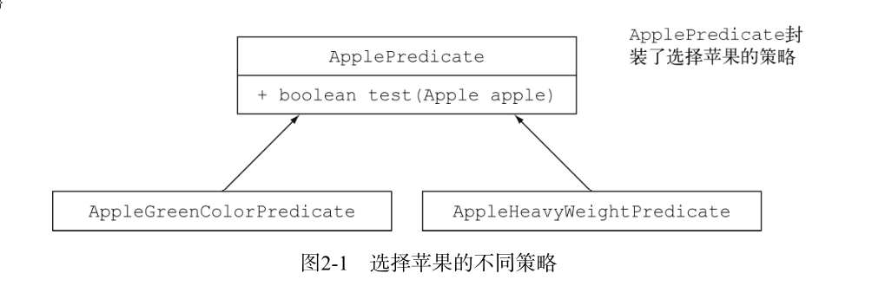
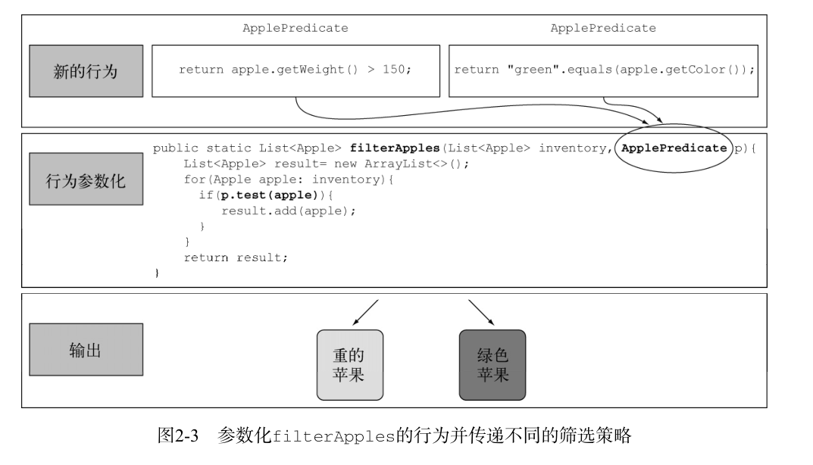

# 通过行为参数化传递代码

> **如何对你的代码加以改进，从而更灵活地适应不断变化的需求?**

**行为参数化就是可以帮你处理频繁变更的需求的一种软件开发模式.**

一言以蔽之，它意味
着拿出一个代码块，把它准备好却不去执行它。这个代码块以后可以被你程序的其他部分调用，
这意味着你可以推迟这块代码的执行。例如，你可以将代码块作为参数传递给另一个方法，稍后
再去执行它。这样，这个方法的行为就基于那块代码被参数化了。

**打个比方吧:**

你的室友知道怎么开车去超市，再开回家。于是你可
以告诉他去买一些东西，比如面包、奶酪、葡萄酒什么的。这相当于调用一个 goAndBuy 方法，把
购物单作为参数。然而，有一天你在上班，你需要他去做一件他从来没有做过的事情：从邮局取一
个包裹。现在你就需要传递给他一系列指示了：去邮局，使用单号，和工作人员说明情况，取走包
裹。你可以把这些指示用电子邮件发给他，当他收到之后就可以按照指示行事了。你现在做的事情
就更高级一些了，相当于一个方法： go ，它可以接受不同的新行为作为参数，然后去执行.


## 应对不断变化的需求

编写能够应对变化的需求的代码并不容易。让我们来看一个例子，我们会逐步改进这个例子，
以展示一些让代码更灵活的最佳做法。就农场库存程序而言，你必须实现一个从列表中筛选绿苹
果的功能。听起来很简单吧？

第一个解决方案可能是下面这样的：

```java
 /**
     *筛选绿苹果
     * @param inventory 苹果仓库
     * @return
     */
    public static List<Apple> filterGreenApples(List<Apple> inventory){
        List<Apple> result = new ArrayList<>();

        for(Apple apple:inventory){
            if ("green".equals(apple.getColor())){
                result.add(apple);
            }
        }
        return result;

    }
```
现在农民改主意了，他还想要筛选红苹果。
你该怎么做呢？简单的解决办法就是复制这个方法，把名字改成 filterRedApples ，然后更改
if 条件来匹配红苹果。然而，要是农民想要筛选多种颜色：浅绿色、暗红色、黄色等，这种方法
就应付不了了。一个良好的原则是在编写类似的代码之后，尝试将其抽象化。

```java
 /**
     * 把颜色参数化,应对颜色变化的需求
     * @param inventory
     * @param color
     * @return
     */
    public static List<Apple> filterApplesByColor(List<Apple> inventory,
                                                  String color) {
        List<Apple> result = new ArrayList<Apple>();
        for (Apple apple: inventory){
            if ( apple.getColor().equals(color) ) {
                result.add(apple);
            }
        }
        return result;
    }
```

这时,农民不断提新需求,按重量刷选,按装量和颜色筛选,于是你不断修改代码,粘贴复制,
一种把所有属性结合起来的笨拙尝试如下所示：

```java

public static List<Apple> filterApples(List<Apple> inventory, String color,
int weight, boolean flag) {
        List<Apple> result = new ArrayList<Apple>();
        for (Apple apple: inventory){
                if ( (flag && apple.getColor().equals(color)) ||
                    (!flag && apple.getWeight() > weight) ){
                    result.add(apple);
                }
            }
        return result;
}
```
这个解决方案再差不过了。首先，客户端代码看上去糟透了。 true 和 false 是什么意思？此
外，这个解决方案还是不能很好地应对变化的需求。如果这位农民要求你对苹果的不同属性做筛
选，比如大小、形状、产地等，又怎么办？而且，如果农民要求你组合属性，做更复杂的查询，
比如绿色的重苹果，又该怎么办？你会有好多个重复的 filter 方法，或一个巨大的非常复杂的
方法。

但如今这种情况下，你需要一种更好的方式，来把
苹果的选择标准告诉你的 filterApples 方法

## 行为参数化

你需要一种比添加很多参数更好的方法来应对变化的需求。让
我们后退一步来看看更高层次的抽象。

一种可能的解决方案是对你的选择标准建模：你考虑的
是苹果，需要根据 Apple 的某些属性（比如它是绿色的吗？重量超过150克吗？）来返回一个
boolean 值。我们把它称为谓词（即一个返回 boolean 值的函数）。让我们定义一个接口来对选
择标准建模：

```java
public interface ApplePredicate {

    boolean test (Apple apple);
}
```
现在你就可以用 ApplePredicate 的多个实现代表不同的选择标准了.
```java
/**
 * 选出重苹果的实现类
 *
 * @author itguang
 * @create 2017-11-11 8:59
 **/
public class AppleHeavyWeightPredicate implements ApplePredicate{
    @Override
    public boolean test(Apple apple) {
        return apple.getWeight()>150;
    }
}
```

```java
/**
 * 选出绿苹果的实现类
 *
 * @author itguang
 * @create 2017-11-11 9:00
 **/
public class AppleGreenColorPredicate implements ApplePredicate {
    @Override
    public boolean test(Apple apple) {
        return "green".equals(apple.getColor());
    }
}
```



你可以把这些实现类看做filter方法的不同行为,刚做的这些和策略设计模式相关,他让你定义一簇算法(称为 :策略),然后在运行时选择一个算法。在这里，
 算法族就是 ApplePredicate ，不同的策略就是 AppleHeavyWeightPredicate 和 AppleGreen-ColorPredicate 。  
                                                          
但是，该怎么利用 ApplePredicate 的不同实现呢？

你需要 filterApples 方法接受
ApplePredicate 对象，对 Apple 做条件测试。这就是行为参数化：让方法接受多种行为（或战
略）作为参数，并在内部使用，来完成不同的行为。

 filter 方法看起来是这样的:
 ```java
 /**
     * 根据抽象条件进行筛选
     * @param inventory
     * @param applePredicate
     * @return
     */
    public  static List<Apple> filter(List<Apple> inventory, ApplePredicate applePredicate){
        ArrayList<Apple> list = new ArrayList<>();
        for (Apple apple:list){
            if(applePredicate.test(apple)){
                    list.add(apple);
            }
        }
        return list;

    }
```
* 1. 传递代码/行为:

这里值得停下来小小地庆祝一下。这段代码比我们第一次尝试的时候灵活多了，读起来、用
起来也更容易！现在你可以创建不同的 ApplePredicate 对象，并将它们传递给 filterApples
方法.
你已经做成了一件很酷的事： filterApples 方法的行为取决于你通过 ApplePredicate 对象传递的代码。换句话说，你把 filterApples 方法的行为参数化了！

请注意，在上一个例子中，唯一重要的代码是 test 方法的实现，如图2-2所示；正是它定义
了 filterApples 方法的新行为。但令人遗憾的是，由于该 filterApples 方法只能接受对象，
所以你必须把代码包裹在 ApplePredicate 对象里。你的做法就类似于在内联“传递代码”，因
为你是通过一个实现了 test 方法的对象来传递布尔表达式的



这就是说行为参数化是一个有用的概念的原因。你应该把它放进你的工具箱里，用来编写灵
活的API

## 对付啰嗦

到此,我们觉得已经做的很好了,我们使用行为参数化解决了一些棘手的问题.
但是,目前来说，当要把新的行为传递给
filterApples 方法的时候，你不得不声明好几个实现 ApplePredicate 接口的类，然后实例化
好几个只会提到一次的 ApplePredicate 对象。

Java有一个机制称为匿名类，它可以让你同时
声明和实例化一个类。它可以帮助你进一步改善代码，让它变得更简洁。但这也不完全令人满意。它往往很笨重，因为它占用了很多空间。

## 使用 Lambda 表达式

```java
//将 List 类型抽象化
    public static <T> List<T> filter(List<T> list, Predicate<T> p){
        List<T> result = new ArrayList<>();
        for(T e: list){
            if(p.test(e)){
                result.add(e);
            }
        }
        return result;
    }
```

```java
 @Test
    public  void test1(){
        List<Apple> result = AppleUtil.filter(initInventory(), (Apple apple) -> "green".equals(apple.getColor()));
        System.out.println(result);
    }
```


## 举例1: 用 Comparator 来排序

对集合进行排序是一个常见的编程任务。比如，你的那位农民朋友想要根据苹果的重量对库
存进行排序，或者他可能改了主意，希望你根据颜色对苹果进行排序。听起来有点儿耳熟？是的，
你需要一种方法来表示和使用不同的排序行为，来轻松地适应变化的需求。

**在Java 8中， List 自带了一个 sort 方法（你也可以使用 Collections.sort ）。 sort 的行为
  可以用 java.util.Comparator 对象来参数化，它的接口如下：**
  
  ```java
// java.util.Comparator
public interface Comparator<T> {
    public int compare(T o1, T o2);
}
```
因此，你可以随时创建 Comparator 的实现，用 sort 方法表现出不同的行为。比如，你可以
使用匿名类，按照重量升序对库存排序：

```java
 /**
     * 对仓库的苹果按重量升序排序
     */
    @Test
    public void test2(){
        List<Apple> inventory = initInventory();
        inventory.sort(new Comparator<Apple>() {
            @Override
            public int compare(Apple o1, Apple o2) {
                return o1.getWeight().compareTo(o2.getWeight());
            }
        });

        System.out.println(inventory);
    }
```

如果农民改了主意，你可以随时创建一个 Comparator 来满足他的新要求，并把它传递给
sort 方法。而如何进行排序这一内部细节都被抽象掉了。用Lambda表达式的话，看起来就是
这样:
```java
  /**
     * 用Lambda表达式对仓库的苹果按重量升序排序
     */
    @Test
    public void test3(){
        List<Apple> inventory = initInventory();
        inventory.sort((Apple o1,Apple o2)->o1.getWeight().compareTo(o2.getWeight()));
        System.out.println(inventory);

    }
```

现在暂时不用担心这个新语法，下一章我们会详细讲解如何编写和使用Lambda表达式。

## 举例2:用 Runnable 执行代码块

线程就像是轻量级的进程：它们自己执行一个代码块。但是，怎么才能告诉线程要执行哪块
代码呢？多个线程可能会运行不同的代码。我们需要一种方式来代表稍候执行的一段代码。在
Java里，你可以使用 Runnable 接口表示一个要执行的代码块。请注意，代码不会返回任何结果
（即 void ）：

```java
// java.lang.Runnable
public interface Runnable{
     public void run();
}
```

你可以像下面这样，使用这个接口创建执行不同行为的线程：

```java
Thread t = new Thread(new Runnable() {
   public void run(){
       System.out.println("Hello world");
   }
});
```

用Lambda表达式的话，看起来是这样：
```java
Thread t = new Thread(() -> System.out.println("Hello world"));
```

## 小结

*  行为参数化，就是一个方法接受多个不同的行为作为参数，并在内部使用它们，完成不
  同行为的能力。

* 行为参数化可让代码更好地适应不断变化的要求，减轻未来的工作量。

* 传递代码，就是将新行为作为参数传递给方法。但在Java 8之前这实现起来很啰嗦。为接
  口声明许多只用一次的实体类而造成的啰嗦代码，在Java 8之前可以用匿名类来减少。

*  Java API包含很多可以用不同行为进行参数化的方法，包括排序、线程和GUI处理。


