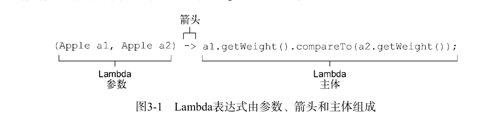
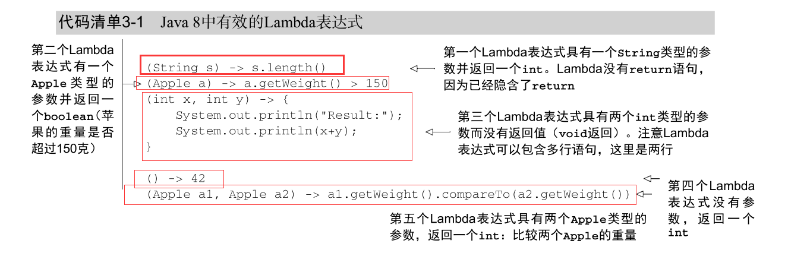
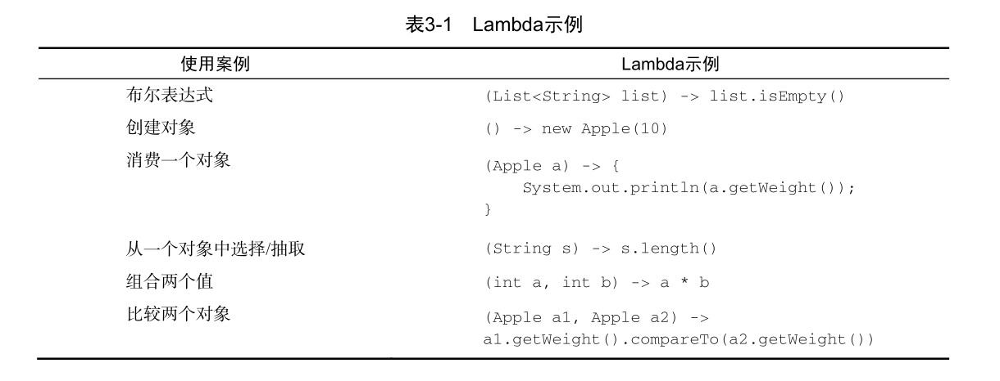
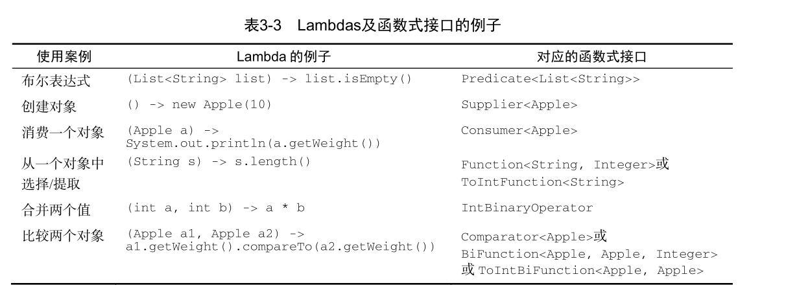
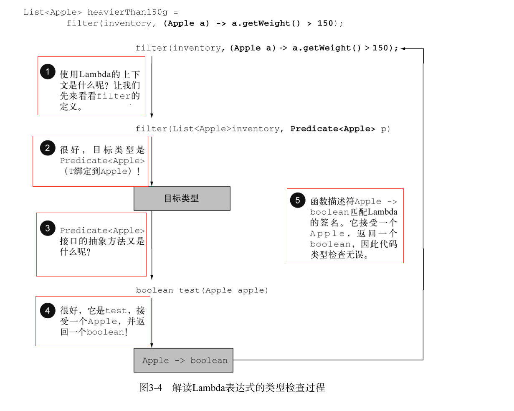
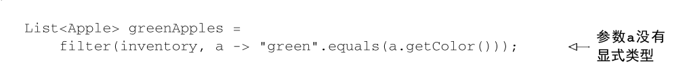
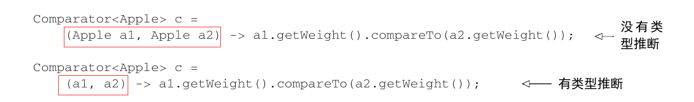
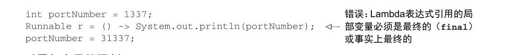

# Lambda 表达式

前片文章讲到,使用匿名类来表示不同的行为并不令人满意：代码十分啰嗦，这会影响程序
       员在实践中使用行为参数化的积极性。在本章中，我们会教给你Java 8中解决这个问题的新工
       具——Lambda表达式。它可以让你很简洁地表示一个行为或传递代码。现在你可以把Lambda
       表达式看作匿名功能，它基本上就是没有声明名称的方法，但和匿名类一样，它也可以作为参
       数传递给一个方法。

本章的行文思想就是教你如何一步一步地写出更简洁、更灵活的代码。

## Lambda 管中窥豹

可以吧Lambda表达式简单的理解为可以可以传递匿名函数的一种形式:它没有名称,但是有参数列表,函数主体,返回类型,甚至还可以有一个可以抛出异常的函数列表.

* 匿名:我们说匿名，是因为它不像普通的方法那样有一个明确的名称：写得少而想得多！
* 函数: 我们说它是函数，是因为Lambda函数不像方法那样属于某个特定的类。但和方法一样，Lambda有参数列表、函数主体、返回类型，还可能有可以抛出的异常列表。
* 传递:Lambda表达式可以作为参数传递给方法或存储在变量中.
* 简洁:无需像匿名类那样写很多模版代码.

在前面的讲解中,我们写过一个简单的Lambda表达式



可以看到,Lambda表达式有三个部分:
*  参数列表:这里它采用了 Comparator 中 compare 方法的参数，两个 Apple 。
* 箭头:把参数和函数主题分开.
* Lambda主体: 比较两个 Apple 的重量。表达式就是Lambda的返回值了。

为了进一步说明，下面给出了Java 8中五个有效的Lambda表达式的例子。



java语言设计者选择这样的语法,是因为C#和Scala等语言中的类似功能广受欢迎.Lambda的基本语法就是:

```java
(parameters) -> expression
```
或(请注意语句的花括号)
```java
(parameters) -> { statements; }
```



## 函数式接口

**一言以蔽之，函数式接口就是只定义一个抽象方法的接口。**

如我们前面创建的:
```java
public interface Predicate<T>{
      boolean test (T t);
}
```

## 函数描述符

函数式接口的抽象方法的签名基本上就是Lambda表达式的签名,我们将这种抽象方法叫做函数描述符.

这很好理解:因为函数式接口只有一个抽象方法,因此我们只需要知道参数列表,和返回值就可以描述这个函数.

例如， Runnable 接口可以看作一个什么也不接受什么也不返回（ void ）的函数的
签名，因为它只有一个叫作 run 的抽象方法，这个方法什么也不接受，什么也不返回（ void ）。

## 使用函数式接口

函数式接口定义且只定义了一个抽象方法.函数式接口很有用,因为抽象方法的签名可以描述为Lambda表达式的签名

函数式接口的抽象方法的签名称为函数描述符.

**Java API中已经有了几个函数式接口**

Java 8的库设计师帮你在 java.util.function 包中引入了几个新的函数式接口。我们接下
来会介绍 Predicate 、 Consumer 和 Function ，更完整的可以查看API.

为了总结关于函数式接口和Lambda的讨论，表3-3总结了一些使用案例、Lambda的例子，以
及可以使用的函数式接口。




## 类型检查

Lambda表达式的类型是从Lambda的上下文中推断出来的,上下文中Lambda表达式需要的类型称为目标类型.

举个上节中的例子:




## 类型推断

java编译器可以从上下文中推断出用什么函数式接口来配合Lambda表达式,这意味着他可以推断出适合Lambda表达式的签名,因为函数描述符也可以从目标类型中得到.
**这样做的好处在于,编译器可以了解Lambda表达式的参数类型**



Lambda表达式有多个参数，代码可读性的好处就更为明显。例如，你可以这样来创建一个
Comparator 对象：



请注意，有时候显式写出类型更易读，有时候去掉它们更易读。没有什么法则说哪种更好；
对于如何让代码更易读，程序员必须做出自己的选择

## 使用局部变量

Lambda表达式也允许使用自有变量(不是参数,是在外层作用域定义的变量),就想匿名类一样,他们被称为捕获Lambda

```java
int portNumber = 1337;
Runnable r = () -> System.out.println(portNumber);
```

需要注意的是:尽管Lambda可以没有限制地捕获（也就是在其主体中引用）实例变量和静态变量。但是局部变量必须显示声明为final,或者事实上就是final.
换句话说:Lambda表达式只能捕获指派给他们的局部变量一次(**（注：捕获实例变量可以被看作捕获最终局部变量 this 。）**),

例如，下面的代码无法编译，因为 portNumber
变量被赋值两次：


### 对局部变量的限制

你可能会问自己，为什么局部变量有这些限制?????

第一,示例变量和局部变量背后的实现有一个关键的不同,**实例变量存储在堆中,局部变量存储在栈中**,
如果Lambda可以直接访问局
部变量，而且Lambda是在一个线程中使用的，则使用Lambda的线程，可能会在分配该变量的线
程将这个变量收回之后，去访问该变量。因此，Java在访问自由局部变量时，实际上是在访问它
的副本，而不是访问原始变量。如果局部变量仅仅赋值一次那就没有什么区别了——因此就有了
这个限制。

第二，这一限制不鼓励你使用改变外部变量的典型命令式编程模式（我们会在以后的各章中
解释，这种模式会阻碍很容易做到的并行处理）

> **闭包:**
> 你可能已经听说过闭包这个词,你可能会想Lambda是否满足闭包的定义.科学的讲,闭包就是一个函数的实例.且它可以无限制的访问那个函数的非本地变量.
例如，闭包可以作为参数传递给另一个函数。它也可以访
问和修改其作用域之外的变量。现在，Java 8的Lambda和匿名类可以做类似于闭包的事情：它们可以作为参数传递给方法，并且可以访问其作用域之外的变量.
但是有一个限制:就是它们不能修改定义Lambda的方法的局部变量的内容.这些变量必须是隐式最终的.可以认为Lambda是对值封闭，而不是对变量封闭.

如前所述: **这种限制的原因在于局部变量保存在栈上,并且隐式表示它们仅限于其所在线程.如果允许捕获局部变量,就会引发造成线程不安全的新得可能性,而这时我们不想看到的**
**实例变量是可以的,因为它们保存在堆中,而堆是在线程中共享的.**


