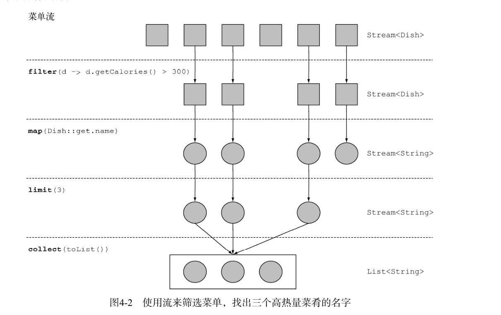
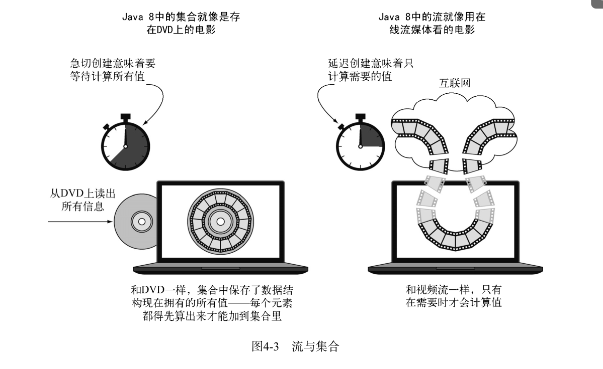
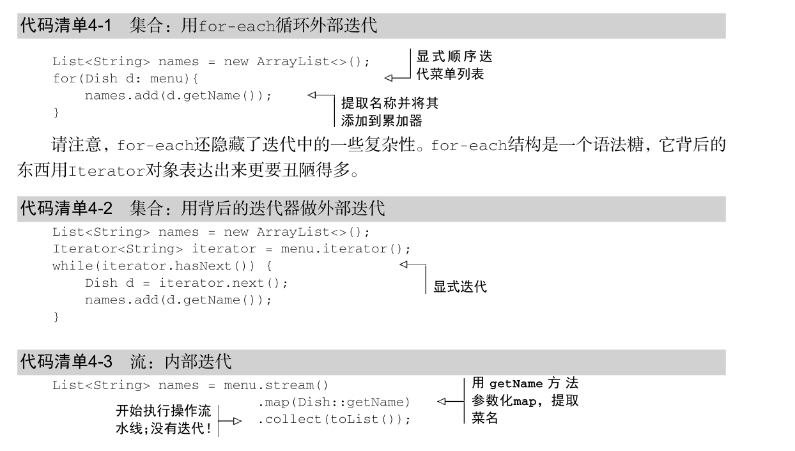

# 函数式数据处理(一)--流

## 引入流

集合是Java中使用最多的API。要是没有集合，还能做什么呢？几乎每个Java应用程序都会制
造和处理集合。集合对于很多编程任务来说都是非常基本的：它们可以让你把数据分组并加以处
理。

*  很多业务逻辑都涉及类似于数据库的操作，比如对几道菜按照类别进行分组 （比如全素
  菜肴），或查找出最贵的菜。你自己用迭代器重新实现过这些操作多少遍？大部分数据库
  都允许你声明式地指定这些操作。比如，以下SQL查询语句就可以选出热量较低的菜肴名
  称： SELECT name FROM dishes WHERE calorie < 400 。你看，你不需要实现如何
  根据菜肴的属性进行筛选（比如利用迭代器和累加器），你只需要表达你想要什么。这个
  基本的思路意味着，你用不着担心怎么去显式地实现这些查询语句——都替你办好了！
  怎么到了集合这里就不能这样了呢？
  
*  要是要处理大量元素又该怎么办呢？为了提高性能，你需要并行处理，并利用多核架构。
  但写并行代码比用迭代器还要复杂，而且调试起来也够受的！

**那Java语言的设计者能做些什么，来帮助你节约宝贵的时间，让你这个程序员活得轻松一点儿呢？你可能已经猜到了，答案就是流。**
  
  

## 流 是什么

流(Stream)是javaAPI的新成员,它允许你以声明性方式处理数据集(通过查询语句来表达而不是临时编写一个实现).
此外,流还可以并行的进行处理,你无须写任何多线程代码了.

首先,我们以一个例子看下流的使用:下面两段代码都是用来返回低热量的菜肴名称的，
并按照卡路里排序，一个是用Java 7写的，另一个是用Java 8的流写的。比较一下。不用太担心
Java 8代码怎么写，我们在接下来的几节里会详细解释。

实体类 Dish.java
```java
public class Dish {

    private final String name;
    private final boolean vegetarian;
    private final int calories;
    private final Type type;
    
    //get/set 略
    }
```
* **java7中实现**

```java
 /**
     * java7
     */
    @Test
    public void test1() {

        //选出低热量菜肴
        ArrayList<Dish> lowCaloricDishes = new ArrayList<>();
        for (Dish dish : menu) {
            if (dish.getCalories() < 400) {
                lowCaloricDishes.add(dish);

            }
        }
        //按照卡路里进行排序
        Collections.sort(lowCaloricDishes, new Comparator<Dish>() {
            @Override
            public int compare(Dish dish1, Dish dish2) {
                return Integer.compare(dish1.getCalories(), dish2.getCalories());
            }
        });
        //输出菜肴名称
        ArrayList<String> lowCaloricDishesName = new ArrayList<>();
        for (Dish dish : lowCaloricDishes) {
            lowCaloricDishesName.add(dish.getName());

        }


        System.out.println(lowCaloricDishesName);

    }
```

在这段代码中，你用了一个“垃圾变量” lowCaloricDishes 。它唯一的作用就是作为一次
性的中间容器。在Java 8中，实现的细节被放在它本该归属的库里了。

* **之后（Java 8）**

```java
/**
     * java8
     */
    @Test
    public void test2() {
        List<String> lowCaloricDishesName =
                menu.stream()
                        //选出低热量菜肴
                        .filter(d -> d.getCalories() < 400)
                        //按照卡路里进行排序
                        .sorted(Comparator.comparing(Dish::getCalories))
                        //输出菜肴名称
                        .map(Dish::getName)
                        .collect(toList());

        System.out.println(lowCaloricDishesName);
    }
```

为了利用多核架构并行执行这段代码，你只需要把 stream() 换成 parallelStream() ：

```java
/**
     * java8多核架构并行执行这段代码
     */
    @Test
    public void test3() {
        List<String> lowCaloricDishesName =
                menu.parallelStream()
                        //选出低热量菜肴
                        .filter(d -> d.getCalories() < 400)
                        //按照卡路里进行排序
                        .sorted(Comparator.comparing(Dish::getCalories))
                        //输出菜肴名称
                        .map(Dish::getName)
                        .collect(toList());

        System.out.println(lowCaloricDishesName);
    }
```

> 你可能会想，在调用 parallelStream 方法的时候到底发生了什么。用了多少个线程？对性
  能有多大提升？后面会详细讨论这些问题
  

现在，你可以看出，从软件工程师的角度来看，新
的方法有几个显而易见的好处:

* 代码是以声明性方式写的:说明想要完成什么,而不是说明如何实现一个操作(利用for if 等控制语句).这种方法加上行为参数化,可以让你很轻松的应对变化的需求,你很容易再创建一个代码版本，利用
Lambda表达式来筛选高卡路里的菜肴，而用不着去复制粘贴代码

* 你可以把几个基础操作连接起来:来表达复杂的数据流水线工作,同时保证代码清晰可读.filter 的结果被传给了 sorted 方法，再传给 map 方法，最后传给 collect 方法。

**需要注意的是: filter(),sorted(),map(), 返回的都是流(Stream),都是Stream的方法,collect()方法除外.关于jdk8的api可以下载此文档[jdk8api](jdk api 1.8_google.CHM)**

## 流简介

java8中的集合支持一个新的stream()方法,它会返回一个流,接口定义在 java.util.stream.Stream中.

那么，流到底是什么呢？简短的定义就是“从支持数据处理操作的源生成的元素序列”。让我们一步步剖析这个定义:
  
* 元素序列: 就像集合一样,刘烨提供了一个接口,可以访问特定元素类型的一组有序值.因为集合是数据结构,所以它的主要目的是以特定的时间/空间复杂度来存储访问元素.但流的目的在于表达计算.
* 源: 流会使用一个提供数据的源,这些源可以是 数组,集合,或输入输出资源.注意:从有序结合生成的流会保留原有的顺序,由列表生成的流,其元素顺序也与列表一致.
* 数据处理操作: 流的数据处理功能类似于数据库的操作.以及函数式编程语言的常用操作.如 filter 、 map 、 reduce 、 find 、 match 、 sort 等。流操作可以顺序执行，也可并行执行。
**此外，流操作有两个重要的特点。**

* 流水线: 很多流操作本身会返回一个流.这样多个操作就可以连接起来形成一个更大的流水线.流水线操作可以看成对数据源进行数据库式查询.
* 内部迭代: 与使用迭代器对集合进行显示迭代不同,流的迭代都是在背后进行的.

让我们来看一段能够体现所有这些概念的代码：
```java
@Test
    public void test4() {
        List<String> lowCaloricDishesName =
                //1.从 menu 获得流（菜肴列表）,建立操作流水线
                menu.parallelStream()
                        //2.选出高热量菜肴
                        .filter(d -> d.getCalories() > 300)
                        //3.输出菜肴名称
                        .map(Dish::getName)
                        //4.只选择前三个
                        .limit(3)
                        //5.将结果保存在另一个List中
                        .collect(toList());

        System.out.println(lowCaloricDishesName);
    }
```

在本例中,我们显示对menu进行stream操作,得到一个流,数据源是菜肴列表menu,接下来对流进行一系列数据处理操作:filter 、 map 、 limit
和 collect 。除了 collect 之外，所有这些操作都会返回另一个流，这样它们就可以接成一条流水线,于是就可以看作对源的一个查询.
最后collect开始处理流水线,并返回一个结果(collect和别的操作不一样,它返回的不是一个流而是一个list).
**在调用collect之前,没有任何结果产生,事实上,根本就没有从menu里选择元素.你可以这么理解：链中的方法调用都在排队等待，直到调用 collect**
  
图4-2显示了流操作的顺序： filter 、 map 、 limit 、 collect ，
每个操作简介如下。



在进一步介绍能对流做什么操作之前，先让我们回过头来看看Collection API和新的Stream
API的思想有何不同
  
## 流与集合

粗略的讲,流与集合的差异就在于什么时候进行计算,集合是内存中的数据结构,它包含数据结构中目前所有的值(结合中每个元素必须先计算出来才能添加到集合中.)  
（你可以往集合里加东西或者删东西，但是不管什么时候，集合中的每个元素都是放在内存里的，元素都得先算出来才能成为集合的一部分。）

相比之下,流是再概念上固定的数据结构.这个思想就是用户仅仅从流中提取需要的值,而这些值,在用户看不见的地方,只会按需生成.
这是一种 生产者--消费者 的关系,从另一个角度来说,流就想一个延迟创建的集合:只有在消费者要求的时候才会计算值（用管理学的话说这就是需求驱动，甚至是实时制造)。
  
与此相反，集合则是急切创建的（供应商驱动：先把仓库装满，再开始卖，就像那些昙花一
现的圣诞新玩意儿一样）。以质数为例，要是想创建一个包含所有质数的集合，那这个程序算起
来就没完没了了，因为总有新的质数要算，然后把它加到集合里面。当然这个集合是永远也创建
不完的，消费者这辈子都见不着了.

图4-3用DVD对比在线流媒体的例子展示了流和集合之间的差异


### **只能遍历一次**

请注意,和迭代器一样,流只能遍历一次,遍历完之后,我们就说这个流已经被消费掉了,
你可以从原始数据源那里再获得一个新的流来重新遍历一遍，就像迭代器一样（这里假设它是集
合之类的可重复的源，如果是I/O通道就没戏了）。例如，以下代码会抛出一个异常，说流已被消
费掉了：java.lang.IllegalStateException: stream has already been operated upon or closed

```java
@Test
    public void test5(){

        List<String> title = Arrays.asList("Java8", "In", "Action");
        Stream<String> stream = title.stream();
        stream.forEach(System.out::println);
        stream.forEach(System.out::println);
    }
```  
所以要记得，流只能消费一次！

### **外部迭代与内部迭代**



内部迭代时，项目可以透明地并行处理，或者用更优化的顺
序进行处理。要是用Java过去的那种外部迭代方法，这些优化都是很困难的。这似乎有点儿鸡蛋
里挑骨头，但这差不多就是Java 8引入流的理由了——Streams库的内部迭代可以自动选择一种适
合你硬件的数据表示和并行实现。

## 流操作

java.util.stream.Stream 中的 Stream 接口定义了许多操作。它们可以分为两大类.
可以连接起来的流操作称为中间操作，关闭流的操作称为终端操作


### **中间操作**
  
注入filter和sorted等中间操作会返回另外一个流,这让多个中间操作可以连接起来形成一个查询.重要的是:
**除非流水线上触发一个终端操作,否则中间操作不会执行任何一个处理--他们很懒,这是因为中间操作一般都可以合并起来,在终端操作时一次性全部处理**

为了搞清楚流水线中到底发生了什么，我们把代码改一改，让每个Lambda都打印出当前处
理的菜肴:
```java
 @Test
    public void test6() {

        List<String> names =
                //1.从 menu 获得流（菜肴列表）,建立操作流水线
                menu.stream()
                        //2.选出高热量菜肴
                        .filter(d -> {
                            System.out.println("filtering" + d.getName());
                            return d.getCalories() > 300;
                        })
                        //3.输出菜肴名称
                        .map(d -> {
                            System.out.println("mapping" + d.getName());
                            return d.getName();
                        })
                        //4.只选择前三个
                        .limit(3)
                        //5.将结果保存在另一个List中
                        .collect(toList());

        System.out.println(names);

    }
```
此代码执行时将打印：
```java
filteringpork
mappingpork
filteringbeef
mappingbeef
filteringchicken
mappingchicken
[pork, beef, chicken]
```
你会惊讶的发现,流操作并没有打印出我们预期的信息.这是因为有好几种优化利用了流的延迟性质.

* 第一:尽管很多菜的热量都高于300卡路里，但只选出了前三个！这是因为 limit 操作和一种称为短路的技巧，我们会在下一章中解释
* 第二，尽管 filter 和 map 是两个独立的操作，但它们合并到同一次遍历中了（我们把这种技术叫作循环合并）。

### **终端操作**

终端操作会从流的流水线生成结果.其结果是任何不是流的值,比如List,Integer,甚至是void.

例如在下面的流水线中,foerach是一个返回void的终端操纵,它会对源中的每道菜应用一个Lambda,把 System.out.println 传递给 forEach ，并要求它打印出由 menu 生成的流中的每一个 Dish ：

```java
menu.stream().forEach(System.out::println);
```
  

# 小结:

* 流是“从支持数据处理操作的源生成的一系列元素”

* 流利用内部迭代：迭代通过 filter 、 map 、 sorted 等操作被抽象掉了。

* 流操作有两类：中间操作和终端操作。

* filter 和 map 等中间操作会返回一个流，并可以链接在一起。可以用它们来设置一条流
  水线，但并不会生成任何结果。
  
*  forEach 和 count 等终端操作会返回一个非流的值，并处理流水线以返回结果

* 流中的元素是按需计算的
  
  
  
  
  
  
  
  
  
  
  
  
  
  
  
  
  
  
  
  
  
  
  
  
  
  
