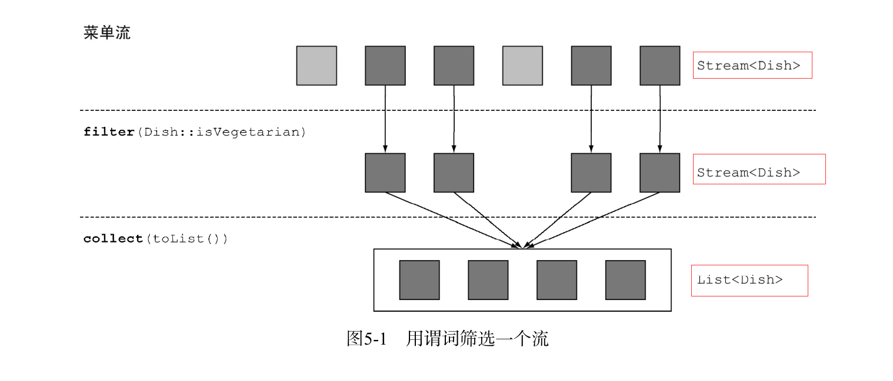
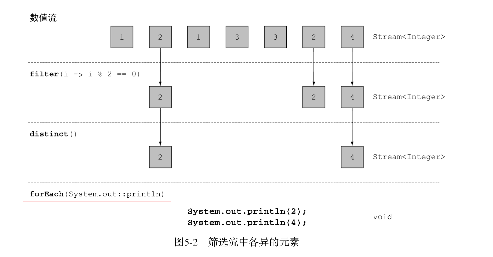
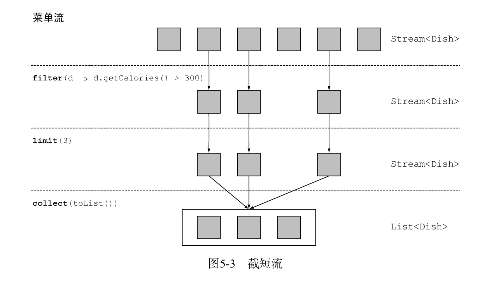
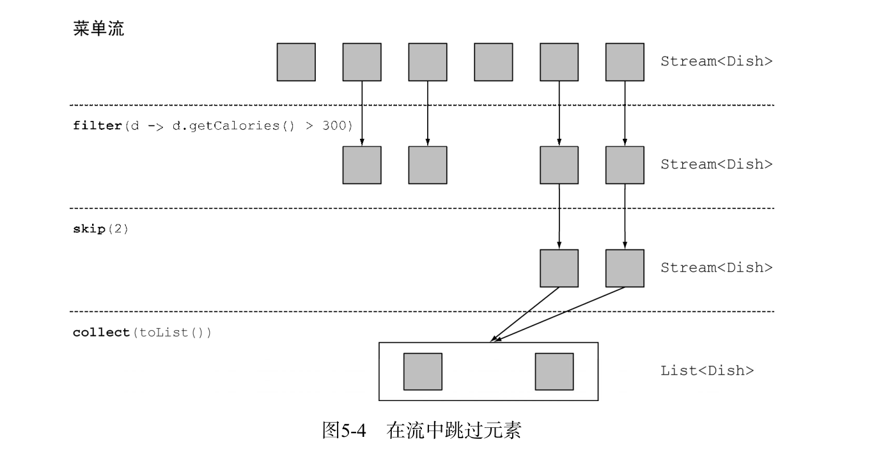
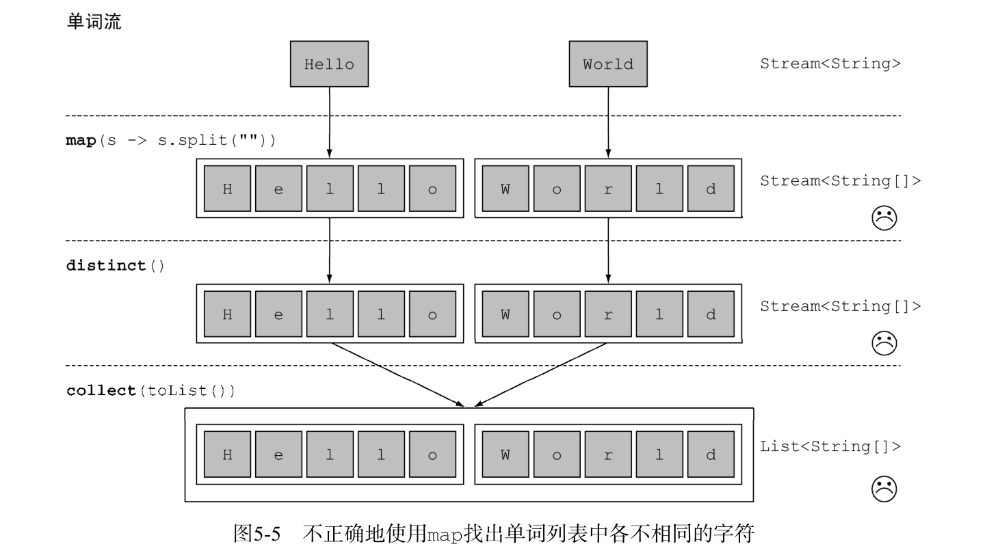
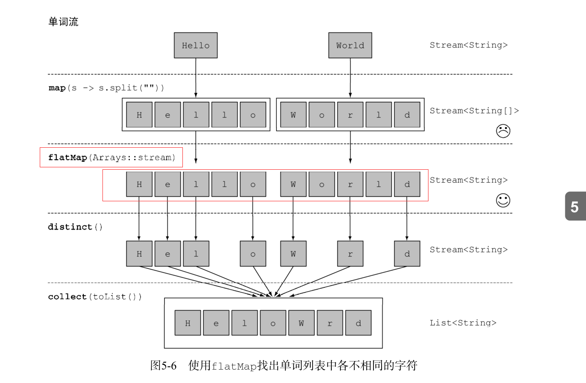
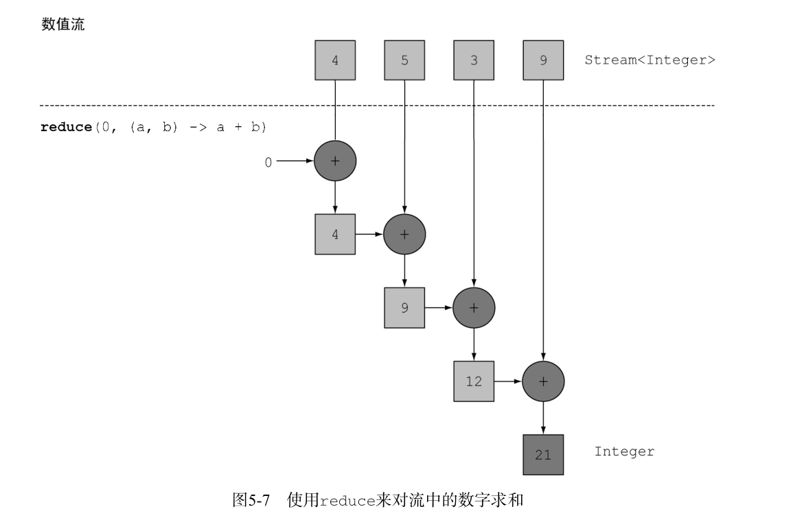
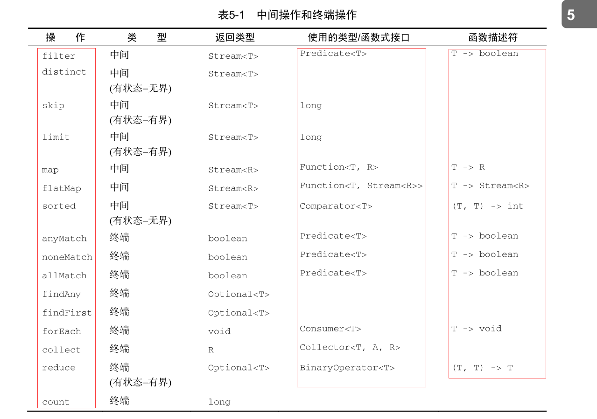
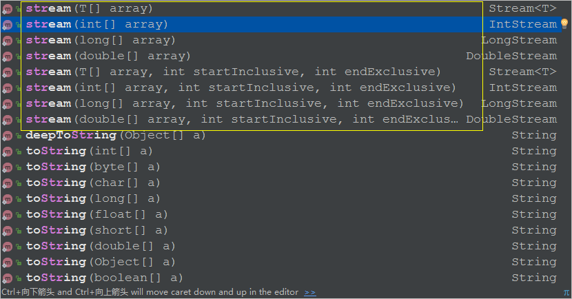

# 使用流

在本章中,你将会看到许多Stream API支持的许多操作.这些操作能让你快速完成许多复杂的查询.如筛选、切片、映射、查找、匹配和归约。
接下来,我们会看到一些特殊的流:数值流,来自文件和数组等多种来源的流,最后是无限流.

## 1 筛选和切片
在本节中，我们来看看如何选择流中的元素：用谓词筛选，筛选出各不相同的元素，忽略流
中的头几个元素，或将流截短至指定长度。

### 1.1 用谓词筛选

**filter()方法:**

该操作会接受一个谓词作为参数,并返回一个包含所有符合谓词元素的流.
例如，你可以像下图所示的这样，筛选出所有素菜，创建一张素食菜单：
```java
@Test
    public void test2() {

        List<Dish> vegetarianMenu =
                menu.stream()
                        .filter(Dish::isVegetarian)
                        .collect(toList());
        System.out.println(vegetarianMenu);
    }
```


### 1.2 筛选各异的元素

 **distinct()方法:**
它会返回一个元素各异的流(根据流所生成元素的hashCode 和 equals 方法实现),

例如，以下代码会筛选出列表中所有的偶数，并确保没有重复。

```java
 @Test
    public void test3() {
        List<Integer> numbers = Arrays.asList(1, 2, 1, 3, 3, 2, 4);

       numbers.stream()
                .filter(i -> i % 2 == 0)
                .distinct()
                .forEach(System.out::println);


    }
```



### 1.3 截短流

**limit()方法:**
该方法会返回一个不超过给定长度的流。所需的长度作为参数传递
给 limit 。如果流是有序的，则最多会返回前 n 个元素。

```java
List<Dish> dishes = menu.stream()
.filter(d -> d.getCalories() > 300)
.limit(3)
.collect(toList());
```

你可以看到，该方法只选出了符合谓词的头三个元素，
然后就立即返回了结果。

请注意 limit 也可以用在无序流上，比如源是一个 Set 。这种情况下， limit 的结果不会以
任何顺序排列



### 1.4 跳过元素

流还支持 skip(n) 方法，返回一个扔掉了前 n 个元素的流。如果流中元素不足 n 个，则返回一
个空流。请注意， limit(n) 和 skip(n) 是互补的！

```java
 @Test
    public void test4() {

        List<Dish> vegetarianMenu = menu.stream().filter(dish -> dish.getCalories() > 300)
                .skip(2)
                .collect(toList());

        System.out.println(vegetarianMenu);
    }
```



## 2 映射

一个非常常见的数据处理套路就是从某些对象中选择信息.比如在sql中,你可以选择一列.
Stream API也通过 map()和flatMap()方法提供了类似的工具.

### 2.1 对流中每一个元素应用函数

**map()**

**它会接受一个函数作为参数,这个函数会被应用到每个元素上.并将其映射成一个新的元素.**

例如，下面的代码把方法引用 Dish::getName 传给了 map 方法，
来提取流中菜肴的名称：

```java
@Test
    public void test5() {

        List<String> vegetarianMenu =
                menu.stream()
                        .map(Dish::getName)
                        .collect(toList());

        System.out.println(vegetarianMenu);
    }
```

因为 getName 方法返回一个 String ，所以 map 方法输出的流的类型就是 Stream<String> 。

让我们看一个稍微不同的例子来巩固一下对 map 的理解。给定一个单词列表，你想要返回另
一个列表，显示每个单词中有几个字母。怎么做呢？你需要对列表中的每个元素应用一个函数。
这听起来正好该用 map 方法去做！

```java
 @Test
    public void test6() {

        List<String> words = Arrays.asList("Java 8", "Lambdas", "In", "Action");
        List<Integer> integers = words.stream()
                .map(String::length)
                .collect(toList());

        System.out.println(integers);
    }
```
结果:
```
[6, 7, 2, 6]
```

现在让我们回到提取菜名的例子。如果你要找出每道菜的名称有多长，怎么做？你可以像下
面这样，再链接上一个 map ：

```java
@Test
    public void test7() {

       List<Integer> integers = menu.stream()
               .map(Dish::getName)
               .map(String::length)
               .collect(toList());
       System.out.println(integers);
   }
```

结果:
```
[4, 4, 7, 12, 4, 12, 5, 6, 6]
```

### 2.2 流的扁平化

你已经看到如何使用 map 方法返回列表中每个单词的长度了。让我们拓展一下：对于一张单
词 表 ， 如 何 返 回 一 张 列 表 ， 列 出 里 面 各 不 相 同 的 字 符 呢 ？ 例 如 ， 给 定 单 词 列 表
["Hello","World"] ，你想要返回列表 ["H","e","l", "o","W","r","d"] 。

你可能首先想到这样做

```java
 @Test
    public void test9() {
       List<String> words = Arrays.asList("Hello","World");
       List<String[]> list = words.stream()
               .map(word -> word.split(""))
               .distinct()
               .collect(toList());

       System.out.println(list);

   }
```
这个方法的问题在于，传递给 map 方法的Lambda为每个单词返回了一个 String[] （ String
列表）。因此， map 返回的流实际上是 Stream<String[]> 类型的。你真正想要的是用
Stream<String> 来表示一个字符流.



结果;
```
[[Ljava.lang.String;@1def03a, [Ljava.lang.String;@122cdd0]
```

**使用 flatMap()**

```java
 @Test
    public void test11() {
       List<String> words = Arrays.asList("Hello","World");
       List<String> list = words.stream()
               .map(word -> word.split(""))
               .flatMap(Arrays::stream)
               .distinct()
               .collect(toList());

       System.out.println(list);

   }
```
结果:
```
[H, e, l, o, W, r, d]
```

要想搞清楚 flatMap() 的效果,我们首先来看看 Arrays.stream() 方法

```java
@Test
    public void test10() {
       List<String> words = Arrays.asList("Hello","World");
       List<Stream<String>> list = words.stream()
               .map(word -> word.split(""))
               .map(Arrays::stream)
               .distinct()
               .collect(toList());

       System.out.println(list);

   }
```
结果:
```
[java.util.stream.ReferencePipeline$Head@1591d15, java.util.stream.ReferencePipeline$Head@1ae6ba4]
```
可以看出,Arrays.stream() 的方法可以接受一个数组并产生一个流.

而 flatMap(Arrays::stream) 的效果就是 把两个流合并起来,即扁平化为一个流.



flatMap() 的参数是 Stream类型.


```java
   <R> Stream<R> map(Function<? super T, ? extends R> mapper);

   <R> Stream<R> flatMap(Function<? super T, ? extends Stream<? extends R>> mapper);

```
## 3 查找和匹配

另一个常见的数据处理套路是看看数据集中的某些元素是否匹配一个给定的属性。Stream
API通过 allMatch 、 anyMatch 、 noneMatch 、 findFirst 和 findAny 方法提供了这样的工具

### 3.1 检查谓词是否至少匹配一个元素
 
 **anyMatch()**

```java
@Test
    public void test12() {
       boolean b = menu.stream().anyMatch(Dish::isVegetarian);
       if(b){
           System.out.println("有素菜!");

       }

   }
```
anyMatch 方法可以回答“流中是否有一个元素能匹配给定的谓词”。

anyMatch 方法返回一个 boolean ，因此是一个终端操作.

### 3.2 检查谓词是否匹配所有元素

**allMatch()**

```java
 @Test
    public void test13() {
        boolean b = menu.stream()
                .allMatch(dish -> dish.getCalories() < 1000);
        if (b) {
            System.out.println("没有高热量事物,吃!");
        }

    }
```

**noneMatch()**

和 allMatch 相对的是 noneMatch 。它可以确保流中没有任何元素与给定的谓词匹配

```java
  @Test
    public void test14() {
        boolean b = menu.stream().noneMatch(dish -> {
            return dish.getCalories() > 1000;
        });
        if (b) {
            System.out.println("没有高热量事物,吃!");
        }

    }
```

> **短路求值**

有些操作不需要处理整个流就能得到结果。例如，假设你需要对一个用 and 连起来的大布
尔表达式求值。不管表达式有多长，你只需找到一个表达式为 false ，就可以推断整个表达式
将返回 false ，所以用不着计算整个表达式。这就是 短路。

对于流而言，某些操作（例如 allMatch 、 anyMatch 、 noneMatch 、 findFirst 和 findAny ）
不用处理整个流就能得到结果。只要找到一个元素，就可以有结果了。同样， limit 也是一个
短路操作：它只需要创建一个给定大小的流，而用不着处理流中所有的元素。在碰到无限大小
的流的时候，这种操作就有用了：它们可以把无限流变成有限流.

### 3.3 查找元素

**findAny()**

```java
 @Test
    public void test15() {
        Optional<Dish> any = menu.stream()
                .filter(dish -> dish.getCalories() == 450)
                .findAny();
        System.out.println(any);

       any.ifPresent(dish -> {
            System.out.println(dish.getCalories());
        });

    }
```
结果:
```
Optional[Dish{name='salmon', vegetarian=false, calories=450, type=FISH}]
450
```

可以看到 findAny() 返回一个 Optional 类型的值,

> Optional 简介
Optional<T> 类（ java.util.Optional ）是一个容器类，代表一个值存在或不存在。在
上面的代码中， findAny 可能什么元素都没找到。Java 8的库设计人员引入了 Optional<T> ，这
样就不用返回众所周知容易出问题的 null 了。

Optional 里面几种可以迫使你显式地检查值是否存在或处理值不存在的情形的方法也不错。
*  isPresent() 将在 Optional 包含值的时候返回 true , 否则返回 false 。
*  ifPresent(Consumer<T> block) 会在值存在的时候执行给定的代码块。我们在第3章
  介绍了 Consumer 函数式接口；它让你传递一个接收 T 类型参数，并返回 void 的Lambda
  表达式。
*  T get() 会在值存在时返回值，否则抛出一个 NoSuchElement 异常。
*  T orElse(T other) 会在值存在时返回值，否则返回一个默认值。

### 3.4 查找第一个元素

**FindFirst()**

用来找到流中的第一个元素,它的工作方式类似于 findany

```java
 @Test
    public void test16() {
        List<Integer> someNumbers = Arrays.asList(1, 2, 3, 4, 5);
        Optional<Integer> firstSquareDivisibleByThree =
                someNumbers.stream()
                        .map(x -> x * x)
                        .filter(x -> x % 3 == 0)
                        .findFirst(); // 9
        System.out.println(firstSquareDivisibleByThree);
        firstSquareDivisibleByThree.ifPresent(System.out::println);

    }
```
结果:
```
Optional[9]
9
```

> 何时使用 findFirst 和 findAny????

**你可能会想，为什么会同时有 findFirst 和 findAny 呢？答案是并行。找到第一个元素
  在并行上限制更多。如果你不关心返回的元素是哪个，请使用 findAny ，因为它在使用并行流
  时限制较少。**


## 4 归约

到目前为止,你所见到的终端操作都返回一个boolean(allMatch之类),void(forEach),或Optional对象(findOny等).你也见过了可以用collect来将流中的元素合成一个List.

接下来,你将会看到如何把一个流中的元素组合起来,比如“计算菜单中的总卡路里”或“菜单中卡路里最高的菜是哪一个”.

此类查询需要将流反复组合起来,得到一个值比如Integer,这样的查询可被归类为 **归约** 操作.

用函数式编程的术语来说,这称为折叠(fold),因为你可以讲这个流看作一张长长的纸(你的流),反复折叠成一个小方块,这就是折叠操作的结果.

### 4.1 元素求和

**reduce()**

先看使用java8之前的 for-each 的做法

```java
int sum = 0;
for (int x : numbers) {
    sum += x;
}
```
numbers中的每一个元素都使用加法运算反复迭代来得到结果.通过反复使用加法,你把一个数字列表归约成了一个数字.

要是还能把所有的数字相乘，而不必去复制粘贴这段代码，岂不是很好？这正是 reduce 操
作的用武之地，它对这种重复应用的模式做了抽象。你可以像下面这样对流中所有的元素求和

```java
 @Test
    public void test17() {
        List<Integer> numbers = Arrays.asList(1, 2, 3, 4, 5);
        Integer reduce = numbers.stream().reduce(0, (a, b) -> a + b);

        System.out.println(reduce);//15


    }
```
reduce 接受两个参数：
*  一个初始值，这里是0
*  一个 BinaryOperator<T> 来将两个元素结合起来产生一个新值，这里我们用的是
  lambda (a, b) -> a + b 
  
上面的操作效果我们可以理解为:把初始值和后面的函数每一次计算的结果相加求和.

```java
 @Test
    public void test17() {
        List<Integer> numbers = Arrays.asList(1, 2, 3, 4, 5);
        Integer reduce = numbers.stream()
                .reduce(1, (a,b)->a*b);
        System.out.println(reduce);//120

    }
```
这个操作效果我们可以理解为:把初始值和后面的函数每一次计算的结果相乘.

**通过这两个例子我们可以看到:reduce两个参数的运算方式取决于后面Lambda的运算方式**




Lambda反复结合每个元素，直到流被归约成一个值.

在java8中Integer类多了几个静态方法,
```java
/**
     * Adds two integers together as per the + operator.
     *
     * @param a the first operand
     * @param b the second operand
     * @return the sum of {@code a} and {@code b}
     * @see java.util.function.BinaryOperator
     * @since 1.8
     */
    public static int sum(int a, int b) {
        return a + b;
    }

    /**
     * Returns the greater of two {@code int} values
     * as if by calling {@link Math#max(int, int) Math.max}.
     *
     * @param a the first operand
     * @param b the second operand
     * @return the greater of {@code a} and {@code b}
     * @see java.util.function.BinaryOperator
     * @since 1.8
     */
    public static int max(int a, int b) {
        return Math.max(a, b);
    }

    /**
     * Returns the smaller of two {@code int} values
     * as if by calling {@link Math#min(int, int) Math.min}.
     *
     * @param a the first operand
     * @param b the second operand
     * @return the smaller of {@code a} and {@code b}
     * @see java.util.function.BinaryOperator
     * @since 1.8
     */
    public static int min(int a, int b) {
        return Math.min(a, b);
    }
```

这不正好可以让我们结合Lambda表达式吗!(可能java8的设计者特意增加了这几个操作适应Lambda编程需要),总之我们代码看起来可以更简洁

```java
 @Test
    public void test17() {
        List<Integer> numbers = Arrays.asList(1, 2, 3, 4, 5);
        Integer reduce = numbers.stream()
                .reduce(0, Integer::sum);
        System.out.println(reduce);

    }
```

**无初始值**

reduce还有一个重载的载体,它不接受初始值,但是会返回一个 Optional 对象.

```java
@Test
    public void test18() {
        List<Integer> numbers = Arrays.asList(1, 2, 3, 4, 5);
        Optional<Integer> optional = numbers.stream()
                .reduce(Integer::sum);
        System.out.println(optional);

    }
```
为什么它返回一个 Optional<Integer> 呢？考虑到流中没有值的情况,reduce操作便无法返回其和,因为没有初始值.这就是为什么结果被包裹在一个Optional对象里,以表明结果可能不存在.

### 4.2 求最大值和最小值

```java
  @Test
    public void test19() {
        List<Integer> numbers = Arrays.asList(1, 2, 3, 4, 5);
        Optional<Integer> max = numbers.stream()
                .reduce(Integer::max);
        Optional<Integer> min = numbers.stream().reduce(Integer::min);

        System.out.println("max="+max+",min="+min);

    }
```
给定两个元素能够返回最大值的Lambda,redce会考虑流中的新值和下一个元素,并产生一个新的最大值,直到整个流消耗完.


### 归约方法的优势与并行化

相比于java8之前的迭代求和,我们使用reduce的好处在于,这里的迭代被内部迭代抽象掉了,这让内部迭代可以选择并行执行reduce操作. 而迭代求和的例子要更新共享变量sum,这不是那么容易并行化的.
如果你加入了同步,可能会发现线程竞争抵消掉了并行本应该带来的性能提升.

**这种计算的并行化需要另一种方法:将输入分块,再分块求和,最后再合并起来.**

这正式reduce所提供的,使用流来对所有的元素并行求和时，你的代码几乎不用修改： stream() 换成了 parallelStream().

## 付诸实践

我们先会议一下目前为止讲到的所有流操作



```java
public class TradeTest {


    Trader raoul = new Trader("Raoul", "Cambridge");
    Trader mario = new Trader("Mario", "Milan");
    Trader alan = new Trader("Alan", "Cambridge");
    Trader brian = new Trader("Brian", "Cambridge");

    List<Transaction> transactions = Arrays.asList(
            new Transaction(brian, 2011, 300),
            new Transaction(raoul, 2012, 1000),
            new Transaction(raoul, 2011, 400),
            new Transaction(mario, 2012, 710),
            new Transaction(mario, 2012, 700),
            new Transaction(alan, 2012, 950)
    );


    //(1) 找出2011年发生的所有交易，并按交易额排序（从低到高）。
    @Test
    public  void test1(){

        List<Transaction> list = transactions.stream()
                .filter(transaction -> transaction.getYear() == 2011)
                .sorted(Comparator.comparing(Transaction::getValue))
                .collect(toList());

        System.out.println(list);

    }

    //(2) 交易员都在哪些不同的城市工作过？
    @Test
    public void test2(){

        List<String> list = transactions.stream()
                .map(Transaction::getTrader)
                .map(Trader::getCity)
                .distinct()
                .collect(toList());
        System.out.println(list);

        List<String> list1 = transactions.stream()
                .map(transaction -> transaction.getTrader().getCity())
                .distinct()
                .collect(toList());
        System.out.println(list1);


    }

    //(3) 查找所有来自于剑桥的交易员，并按姓名排序。
    @Test
    public void test3(){
        List<Trader> list = transactions.stream()
                .map(Transaction::getTrader)
                .filter(trader -> trader.getCity().equals("Cambridge"))
                .sorted(Comparator.comparing(Trader::getName))
                .collect(toList());
        System.out.println(list);

        List<Trader> list1 = transactions.stream()
                .filter(transaction -> transaction.getTrader().getCity().equals("Cambridge"))
                .map(Transaction::getTrader)
                .sorted(Comparator.comparing(Trader::getName))
                .collect(toList());

        System.out.println(list1);


    }

    //(4) 返回所有交易员的姓名字符串，按字母顺序排序。
    @Test
    public void test4(){
        List<String> list = transactions.stream()
                .map(Transaction::getTrader)
                .map(Trader::getName)
                .sorted((s1, s2) -> s1.compareTo(s2))
                //.distinct()
                .collect(toList());
        System.out.println(list);


        List<String> list1 = transactions.stream()
                .map(transaction -> transaction.getTrader().getName())
                .sorted((s1, s2) -> s1.compareTo(s2))
                .collect(toList());
        System.out.println(list1);


    }

    //(5) 有没有交易员是在米兰工作的？
    @Test
    public void test5(){
        boolean b = transactions.stream()
                .map(Transaction::getTrader)
                .anyMatch(trader -> trader.getCity().equals("Milan"));
        System.out.println(" 有没有交易员是在米兰工作的？="+b);

        boolean b1 = transactions.stream()
                .anyMatch(transaction -> transaction.getTrader().getCity().equals("Milan"));
        System.out.println(" 有没有交易员是在米兰工作的？="+b1);


    }

    //(6) 打印生活在剑桥的交易员的所有交易额。
    @Test
    public void test6(){
        List<Integer> list = transactions.stream()
                .filter(transaction -> transaction.getTrader().getCity().equals("Cambridge"))
                .map(Transaction::getValue)
                .collect(toList());
        System.out.println(list);
    }

    // (7) 所有交易中，最高的交易额是多少？
    @Test
    public void test7(){
        Optional<Integer> reduce = transactions.stream()
                .map(Transaction::getValue)
                .reduce(Integer::max);
        System.out.println(reduce);

    }

    //(8) 找到交易额最小的交易。
    @Test
    public void test8(){
        Optional<Integer> reduce = transactions.stream()
                .map(Transaction::getValue)
                .reduce(Integer::min);
        System.out.println(reduce);
    }
     //(9) 计算交易总额
        @Test
        public void test9(){
            Integer reduce = transactions.stream()
                    .map(transaction -> transaction.getValue())
                    .reduce(0, Integer::sum);
            System.out.println(reduce);
        }


}

```

## 5 数值流

我们先看下这段代码有什么问题
```java
 //(9) 计算交易总额
    @Test
    public void test9(){
        Integer reduce = transactions.stream()
                .map(transaction -> transaction.getValue())
                .reduce(0, Integer::sum);
        System.out.println(reduce);
    }
```
这段代码的问题是，它有一个暗含的装箱成本。每个 Integer 都必须拆箱成一个原始类型，
再进行求和

Java 8引入了三个原始类型特化流接口来解决这个问题：

### 5.1 原始类型流特化

IntStream,DoubleStream,LongStream 分别将流中的元素特化为 int ,double, long ,从而避免了暗含的装箱成本.

每个接口都带来了进行常用数值归约的新方法，比如对数值流求和的 sum ，找到最大元素的 max 。
此外还有在必要时再把它们转换回对象流的方法。

**映射到数值流**

将流转化为特化版本的常用方法为 mapToInt(),mapToDouble(),mapToLong().

这些方法和前面说的 map 方法的工作方式一样，只是它们返回的是一个特化流，而不是 Stream<T> 

```java
@Test
    public void test20() {
        int sum = menu.stream() //返回一个Stream<Dish>
                .mapToInt(Dish::getCalories) //返回一个IntStream
                .sum();

        System.out.println(sum);

    }
```
**请注意，如果流是空的， sum 默认返回 0 。 IntStream 还支持其他的方便方法，如max 、 min 、 average 等。**

**转换回对象流 boxed()**

同样，一旦有了数值流，你可能会想把它转换回非特化流。
```java
IntStream intStream = menu.stream().mapToInt(Dish::getCalories);
Stream<Integer> stream = intStream.boxed();
```
**默认值 OptionalInt**

要找到 IntStream 中的最大元素，可以调用 max 方法，它会返回一个 OptionalInt ：

```java
 OptionalInt optionalInt = menu.stream()
                .mapToInt(Dish::getCalories)
                .max();
```
现在，如果没有最大值的话，你就可以显式处理 OptionalInt 去定义一个默认值了：
```java
@Test
    public void test21() {
        OptionalInt optionalInt = menu.stream()
                .mapToInt(Dish::getCalories)
                .max();

        int max = optionalInt.orElse(0);


        System.out.println(max);

    }
```

**数值范围**

和数字打交道时，有一个常用的东西就是数值范围。比如，假设你想要生成1和100之间的所有数字.

java8引入了两个可用于 IntStream 和LongStream的静态方法,range 和 rangeclosed.

这两个方法都是第一个参数接受起始值,第二个参数接受结束值,但range是不包含结束值的, rangeclosed包含结束值

```java
 @Test
    public void test22() {

        IntStream intStream = menu.stream()
                .mapToInt(Dish::getCalories);

        IntStream intStream1 = IntStream.range(1, 100)
                .filter(n -> n % 2 == 0);
        System.out.println(intStream1.count());
    }
```

## 6 构建流

本节将介绍如何从值序列、数组、文件来创建流，甚至由生成函数来创建无限流！

### 6.1 由值创建流

**Stream.of()**

你可以通过静态方法 Stream.of() 通过显示值创建一个流,他可以接受任意数量的参数.
```java
@Test
    public void test23() {

        Stream<String> stream = Stream.of("Java 8 ", "Lambdas ", "In ", "Action");
        stream.map(String::toUpperCase).forEach(System.out::println);
    }
```

### 6.2 由数组创建流

**Arrays.stream()**
```java
 @Test
    public void test25() {

        int[] numbers = {2, 3, 5, 7, 11, 13};
        IntStream intStream = Arrays.stream(numbers);
        int sum = intStream.sum();
        System.out.println(sum);
    }
```
Arrays.stream() 有很多重载方法.


### 6.3 由文件创建流

java中用于处理文件等I/O操作的NIO API已经更新,以便利用Stream API.

java.nio.file.Files 中的很多静态方法都会返回一个流。例如，一个很有用的方法是
Files.lines ，它会返回一个由指定文件中的各行构成的字符串流.

统计一个文件中有多少各不相同的词:

```java
@Test
    public void test26() {
        try {
            Stream<String> stream = Files.lines(Paths.get("data.txt"));
            //Arrays.stream()把字符串数组转成流
            long count = stream.flatMap(line -> Arrays.stream(line.split(" ")))
                    .distinct()
                    .count();
            System.out.println(count);
        } catch (IOException e) {
            e.printStackTrace();
        }
    }
```
你可以使用Files.lines得到一个流,其中每个元素都是给定文件中的一行.
然后你可以对每一行进行split方法拆分单词,应该注意的是:你应该如何使用 flatMap()产生一个扁平的单词流.而不是给每一行生成一个单词流.

### 6.4 由函数生成流：创建无限流

Stream API 提供了两个静态方法来从函数生成流: **Stream.iterate和Stream.generate.**

这两个操作可以创建所谓的无限流：不像从固定集合创建的流那样有固定大小的流。由 iterate
和 generate 产生的流会用给定的函数按需创建值，因此可以无穷无尽地计算下去！一般来说，
应该使用 limit(n) 来对这种流加以限制，以避免打印无穷多个值.

**迭代 iterate**
```java
@Test
    public void test27() {
    Stream.iterate(0,n->n+2)
            .limit(10)
            .forEach(System.out::println);
    }
```

iterate 方法接受一个初始值,还有一个作用于每次产生新值上的Lambda（ UnaryOperator<t> 类型）,
这里，我们使用Lambda  n -> n + 2 ，返回的是前一个元
素加上2。因此， iterate 方法生成了一个所有正偶数的流.

这种iterate基本上是顺序的,因为结果取决于前一次应用,请注意，此操作将生成一个无限流——这个流没有结尾，因为值是按需计算的，可以永远计算下去。我们说这个流是无界的。 

**生成 generate**

与 iterate 方法类似， generate 方法也可让你按需生成一个无限流。但 generate 不是依次
对每个新生成的值应用函数的。它接受一个 Supplier<T> 类型的Lambda提供新的值。我们先来
看一个简单的用法：
```java
Stream.generate(Math::random)
.limit(5)
.forEach(System.out::println);
```
# 小结:

以下是你应从本文中学到的关键概念

*  Streams API可以表达复杂的数据处理查询。常用的流操作总结在表5-1中

* 你可以使用 filter ,distinct ,limit ,skip对流做筛选和切片.

* 你可以使用map 和 flstMap 提取或者转换流中的元素

* 你可以使用 findFirst和findAny 查找流中的元素

* 你可以使用anyMatch ,allMatch ,noneMatch 让流匹配给定的谓词

 上面这些方法都利用了短路:找到结果就立即停止计算,没有必要处理整个流.
 
* 你可以使用 reduce 方法将流中的所有元素进行迭代合并成一个结果,例如求和或者查找最大元素

* filter和map操作是无状态的,他们并不存储任何状态.
  reduce 操作要存储状态才能计算出一个值,
  sorted和distinct也要存储状态,因为他们把流中所有元素缓存起来才能返回一个新的流. 这种操作称为有状态操作.
  
* 流有三种基本的原始类型特化： IntStream 、 DoubleStream 和 LongStream 。它们的操作也有相应的特化

* 流不仅可以从集合创建，也可从值、数组、文件以及 iterate 与 generate 等特定方法创建。

* 无限流是没有固定大小的流


