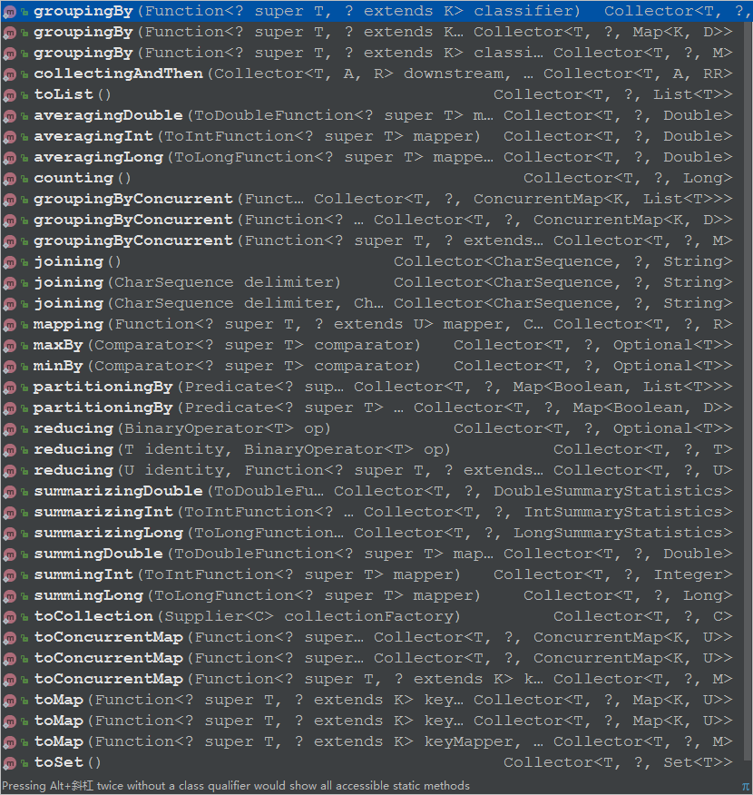
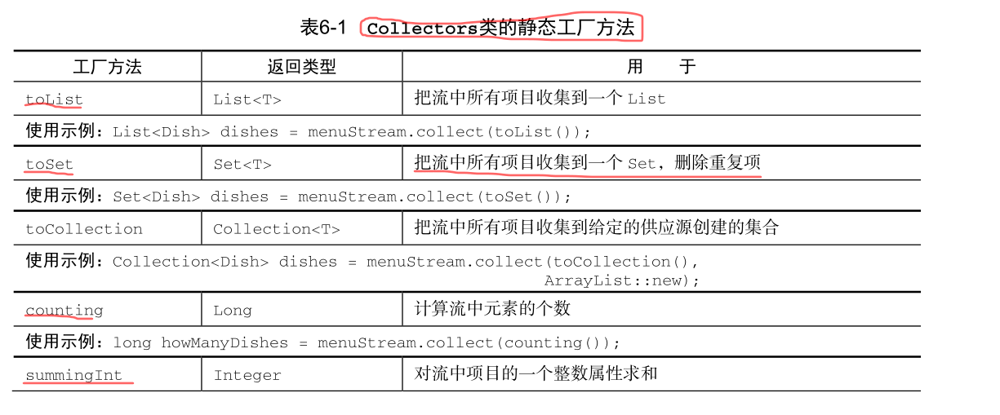
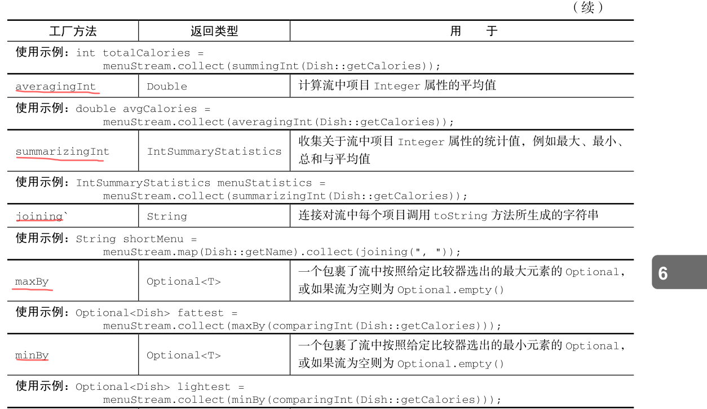
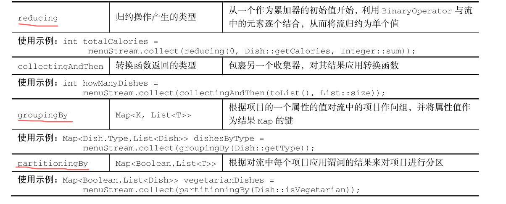

# 用流收集数据

我们已经在前面两篇文章中用过 collect 终端操作了，当时主要是用来把 Stream 中所有的
元素结合成一个 List 。在本章中，你会发现 collect 是一个归约操作，就像 reduce 一样可以接
受各种做法作为参数，将流中的元素累积成一个汇总结果。具体的做法是通过定义新的
Collector 接口来定义的，因此区分 Collection 、 Collector 和 collect 是很重要的。


下面是一个交易列表的例子,看看你用collect和收集器能做什么

*  对一个交易列表按货币分组，获得该货币的所有交易额总和（返回一个 Map<Currency,Integer> ）。

* 将交易列表分成两组：贵的和不贵的（返回一个 Map<Boolean, List<Transaction>> ）。

* 创建多级分组，比如按城市对交易分组，然后进一步按照贵或不贵分组（返回一个Map<Boolean, List<Transaction>> ）。

现在我们有一个 由Transtraction 构成的列表 transactions

```java
        Trader raoul = new Trader("Raoul", "Cambridge");
        Trader mario = new Trader("Mario", "Milan");
        Trader alan = new Trader("Alan", "Cambridge");
        Trader brian = new Trader("Brian", "Cambridge");

   List<Transaction> transactions = Arrays.asList(
                new Transaction(Currency.EUR, 1500.0,brian),
                new Transaction(Currency.USD, 2300.0,raoul),
                new Transaction(Currency.GBP, 9900.0,mario),
                new Transaction(Currency.EUR, 1100.0,alan),
                new Transaction(Currency.JPY, 7800.0,brian),
                new Transaction(Currency.CHF, 6700.0,brian),
                new Transaction(Currency.EUR, 5600.0,mario),
                new Transaction(Currency.USD, 4500.0,mario),
                new Transaction(Currency.CHF, 3400.0,brian),
                new Transaction(Currency.GBP, 3200.0,alan),
                new Transaction(Currency.USD, 4600.0,alan),
                new Transaction(Currency.JPY, 5700.0,alan),
                new Transaction(Currency.EUR, 6800.0,raoul) );

    }
```

我们先看一个例子:**把列表中的交易按货币进行分组**.

在没有Lambda的Java里，哪怕像这种简单的用例实现起来都很啰嗦，就像下面这样。

```java
//用指令式风格对交易按照货币分组
    @Test
    public void test2() {
        Map<Currency, List<Transaction>> transactionsByCurrencies =
                new HashMap<>();
        List<Transaction> transactionsForCurrency = null;
        for (Transaction transaction : transactions) {
            Currency currency = transaction.getCurrency();
            transactionsForCurrency = transactionsByCurrencies.get(currency);
            if (transactionsForCurrency == null) {
                transactionsForCurrency = new ArrayList<>();
                transactionsByCurrencies
                        .put(currency, transactionsForCurrency);
            }
            transactionsForCurrency.add(transaction);
        }
        //遍历map
        for (Currency currency : transactionsByCurrencies.keySet()) {
            List<Transaction> transactions = transactionsByCurrencies.get(currency);
            System.out.println(transactions);

        }


    }
```
结果:
```
[Transaction{currency=EUR, value=1500.0, trader=Trader{name='Brian', city='Cambridge'}}, Transaction{currency=EUR, value=1100.0, trader=Trader{name='Alan', city='Cambridge'}}, Transaction{currency=EUR, value=5600.0, trader=Trader{name='Mario', city='Milan'}}, Transaction{currency=EUR, value=6800.0, trader=Trader{name='Raoul', city='Cambridge'}}]
[Transaction{currency=USD, value=2300.0, trader=Trader{name='Raoul', city='Cambridge'}}, Transaction{currency=USD, value=4500.0, trader=Trader{name='Mario', city='Milan'}}, Transaction{currency=USD, value=4600.0, trader=Trader{name='Alan', city='Cambridge'}}]
[Transaction{currency=CHF, value=6700.0, trader=Trader{name='Brian', city='Cambridge'}}, Transaction{currency=CHF, value=3400.0, trader=Trader{name='Brian', city='Cambridge'}}]
[Transaction{currency=GBP, value=9900.0, trader=Trader{name='Mario', city='Milan'}}, Transaction{currency=GBP, value=3200.0, trader=Trader{name='Alan', city='Cambridge'}}]
[Transaction{currency=JPY, value=7800.0, trader=Trader{name='Brian', city='Cambridge'}}, Transaction{currency=JPY, value=5700.0, trader=Trader{name='Alan', city='Cambridge'}}]
```
就上面的代码而言,不要说写,就是看懂也需要很长时间,不得不承认,我们为了一个简单的功能,竟然写了这么多且又不宜读的代码.如果没有注释,代码的目的一时半会儿很难看出来.

那么对于 **把列表中的交易按货币分组** 这个简单的功能,用Stream的collect方法怎么实现呢?先看一个例子,后面会详解:

```java
 @Test
    public  void test3(){
        Map<Currency, List<Transaction>> listMap = transactions.stream()
                .collect(Collectors.groupingBy(Transaction::getCurrency));

        //遍历map
        for(Currency currency:listMap.keySet()){

            System.out.println(listMap.get(currency));
        }
    }
```
这一看,还真是觉得没有对比就没有伤害啊!

## 1 收集器(Collector)简介

上面的例子清晰的说明了函数式编程相对于指令式编程的优势:你只需要指出希望的结果(做什么),而不用操心执行的步骤(怎么做).

**一般来说,Collector会对每一个元素应用一个转换函数(如:toList()),将结果累积在一个数据结构中,从而产生这一过程的最终输出.**

例如:在上面交易分组的例子中:转换函数提取了每笔交易的货币,随后使用货币作为键,将交易本身累积在生成的Map中.

Collector提供了很多静态工厂方法,可以方便的创建常见的收集器实例,直接拿来用就可以了.



最直接最常用的Collector就是toList()了,它会把流中所有元素收集到一个List中.

## 2 预定义收集器

所谓预定义收集器,就是那些可以从 Collectors类中直接拿来用的静态工厂方法,他们主要提供了三大功能:

* 将流元素归约或汇总为一个值

* 元素分组

* 元素分区

### 2.1 归约和汇总

为了说明从 Collectors 工厂类中能创建出多少种收集器实例，我们重用一下前面文章的例
子：包含一张佳肴列表的菜单！

就像我们之前看到的,在就需要将流项目重组为集合时:一般会使用收集器(Stream的collect参数).

我们先来举一个简单的例子，利用 counting 工厂方法返回的收集器，数一数菜单里有多少
种菜

两种方法:
```java
 @Test
    public  void test4(){
        Long aLong = menu.stream()
                .collect(Collectors.counting());
        System.out.println(aLong);


        long count = menu.stream()
                .count();

        System.out.println(count);

    }
```

另外如果我们导入了
````java
import static java.util.stream.Collectors.*;
````
注意是 static

那么我们的代码就可以不用写 Collectors了,可以直接使用counting()
```java
 Long aLong = menu.stream()
                .collect(counting());
```
#### 2.1.1 找出流中的最大值和最小值

你可以使用两个收集器， Collectors.maxBy 和 Collectors.minBy ，来计算流中的最大或最小值.
这两个收集器都接受一个Comparator 参数来根据热量对菜单进行比较.
```java
//找出菜单里卡路里的最大值和最小值
    @Test
    public  void test6(){

        //使用收集器的方法
        Optional<Dish> max = menu.stream()
                .collect(maxBy(Comparator.comparing(Dish::getCalories)));

        System.out.println(max);

        Optional<Dish> min = menu.stream()
                .collect(minBy(Comparator.comparing(Dish::getCalories)));

        System.out.println(min);

        //使用流的方法
        Optional<Dish> max1 = menu.stream()
                .max(Comparator.comparing(Dish::getCalories));
        System.out.println(max1);

        Optional<Dish> min1 = menu.stream()
                .min(Comparator.comparing(Dish::getCalories));
        System.out.println(min1);

    }
```
你可能会想为什么会返回 Optional<Dish>,现在不用担心，我们会在后面文章中来研究 Optional<T> 及其操作.

#### 2.1.2 汇总

Collectors 类专门为汇总提供了一个工厂方法： Collectors.summingInt 。它可接受一
个把对象映射为求和所需 int 的函数，并返回一个收集器；该收集器在传递给普通的 collect 方
法后即执行我们需要的汇总操作。举个例子来说，你可以这样求出菜单列表的总热量：

```java
//汇总
    @Test
    public void test7(){

        //使用收集器汇总
        Integer sum = menu.stream()
                .collect(summingInt(Dish::getCalories));
        System.out.println(sum);


        //使用流汇总
        Integer sum2 = menu.stream()
                .map(Dish::getCalories)
                .reduce(0, Integer::sum);
        System.out.println(sum2);

    }
```

不过,有时候我们想得到菜单卡路里的最大值,最小值,平均值,和菜单里菜肴数量,是不是要写好多次流操作呢?

幸运的是,Collectors已经为我们提供了这样一个静态工厂方法 summarizingxxx ,

例如，通过一次 summarizing 操作你可以就数出菜单中元素的个数，并得
到菜肴热量总和、平均值、最大值和最小值：

```java
 //汇总
    @Test
    public void test8(){
        IntSummaryStatistics summaryStatistics = menu.stream()
                .collect(summarizingInt(Dish::getCalories));
        System.out.println(summaryStatistics);
        System.out.println(summaryStatistics.getAverage());
    }
```
这个收集器会把所有这些信息收集到一个叫作 IntSummaryStatistics 的类里，它提供了
方便的取值（getter）方法来访问结果。

结果:
```
IntSummaryStatistics{count=9, sum=4300, min=120, average=477.777778, max=800}
477.77777777777777

```
#### 2.1.3 连接字符串 joining

joniing工厂方法返回的Collector 会把对流中的每一个对象应用 toString() 方法得到的字符串连接成一个字符串,

你可以把菜单中所有菜肴的名称连接起来.
```java

    //连接字符串 joining
    @Test
    public void test9(){

        String names = menu.stream()
                .map(Dish::getName)
                .collect(joining());
        System.out.println(names);

        String names2 = menu.stream()
                .map(Dish::getName)
                .collect(joining(", "));
        System.out.println(names2);


    }
```
joining 工厂方法有一个重载版本可以接受元素之间的
分界符，这样你就可以得到一个逗号分隔的菜肴名称列表：

结果:
```
porkbeefchickenfrench friesriceseason fruitpizzaprawnssalmon
pork, beef, chicken, french fries, rice, season fruit, pizza, prawns, salmon
```


#### 2.1.4 广义的归约汇总

事实上,上面我们讨论过的所有收集器,都是一个可以用 reducing 工厂方法定义的归约过程的特殊情况而已.

**Collectors.reducing 工厂方法是所有这些特殊情况的一般化.(注意和Stream.reduce()方法的区分).**

可以说,先前讨论过的方法只是为了方便程序员开发而已,但是,请记住,方便程序员开发可程序可读性恰恰是头等大事.
先看一个 以不同的方法执行同样的操作的例子

```java
 //使用reducing求和,以不同的方法执行同样的操作
    @Test
    public void test10(){

        //使用收集器汇总
        Integer sum = menu.stream()
                .collect(summingInt(Dish::getCalories));
        System.out.println(sum);


        //使用流汇总
        Integer sum2 = menu.stream()
                .map(Dish::getCalories)
                .reduce(0, Integer::sum);
        System.out.println(sum2);

        //把流映射到一个 IntStream ，然后调用 sum 方法
        int sum1 = menu.stream()
                .mapToInt(Dish::getCalories)
                .sum();
        System.out.println(sum1);

        Integer sum3 = menu.stream()
                .collect(reducing(0,//初始值
                        Dish::getCalories,//转换函数
                        Integer::sum));//累积函数
        System.out.println(sum3);


    }

```
我们主要分析第三种方法:

* 第一个参数是归约操作的起始值,也是流没有元素的返回值.

* 第二个参数,将菜肴转换成一个表示其所含热量的int

* 第三个参数是一个二进制操作(BinaryOperator),将两个项目积累成一个同类型的值.这里就是对两个int求和.

同样，你可以使用下面这样单参数形式的 reducing 来找到热量最高的菜，如下所示：

```java
//使用reducing求最大值,以不同的方法执行同样的操作
    @Test
    public void test11(){
        Optional<Dish> dishOptional = menu.stream()
                .collect(reducing((d1, d2) -> d1.getCalories() > d2.getCalories() ? d1 : d2));
        System.out.println(dishOptional);
    }
```
还有我们提到的counting也是收集器也是利用三参数reducing工厂方法实现的.它把流中的每个元素都转换成值为1的Long型对象.然后再把它们相加.

```java
public static <T> Collector<T, ?, Long> counting() {
       return reducing(0L, e -> 1L, Long::sum);
}
```
> 你可能已经注意到了 ? 通配符，它用作 counting 工厂方法返
回的收集器签名中的第二个泛型类型。对这种记法你应该已经很熟悉了，特别是如果你经常使
用Java的集合框架的话。在这里，它仅仅意味着收集器的累加器类型未知，换句话说，累加器
本身可以是任何类型。


#### 根据情况选择最佳解决方案

上面的内容说明了,函数式编程通常提供了多种方法来进行统一个操作.收集器在某种程度
上比 Stream 接口上直接提供的方法用起来更复杂，但好处在于它们能提供更高水平的抽象和概括，也更容易重用和自定义。

我们需要为手头的问题探索不同的解决方案,在通用的解决方案里,始终选择最专门化的一个.

例如，要计菜单的总热量，我们更倾向于 IntStream,因为 IntStream 可以让我们避免自动拆箱操作，也就是从 Integer到 int 的隐式转换，它在这里毫无用处。

```java
  //把流映射到一个 IntStream ，然后调用 sum 方法
        int sum1 = menu.stream()
                .mapToInt(Dish::getCalories)
                .sum();
        System.out.println(sum1);
```

### 2.2 分组

一个常见的数据库操作是根据一个或多个属性对集合中的项目进行分组,如果用指令式编程的话,这个操作可能很麻烦,就想开头的例子一样.
但是如果用java8 所推崇的函数式风格来写的话,就很容易转化为一个可以看懂的语句.

假设你要把菜单中的菜按照类型进行分类，
有肉的放一组，有鱼的放一组，其他的都放另一组。用 Collectors.groupingBy 工厂方法返回
的收集器就可以轻松地完成这项任务，如下所示：

```java
   //分组操作
    @Test
    public void test12(){
        Map<Dish.Type, List<Dish>> typeListMap = menu.stream()
                .collect(groupingBy(Dish::getType));

        System.out.println(typeListMap);

        for (Dish.Type key:typeListMap.keySet()){
            System.out.println(typeListMap.get(key));
        }

    }
```

分组操作的结果是一个Map,把分组函数返回的值作为映射的键(Dish.Type类型),把流中所有与这个键对应的项目列表作为见对应的值(List<Dish>类型).

现在，你已经看到了如何对菜单中的菜肴按照类型和热量进行分组，但要是想同时按照这两
个标准分类怎么办呢？分组的强大之处就在于它可以有效地组合。让我们来看看怎么做。

#### 2.2.1 多级分组

要实现多级分组，我们可以使用一个由双参数版本的 Collectors.groupingBy 工厂方法创
建的收集器，它除了普通的分类函数之外，还可以接受 collector 类型的第二个参数。

```java
//多级分组操作
    @Test
    public void test13() {


        Map<Dish.Type, Map<CaloricLevel, List<Dish>>> map = menu.stream().collect(
                groupingBy(Dish::getType,
                        groupingBy(dish -> {
                            if (dish.getCalories() <= 400) return CaloricLevel.DIET;
                            else if (dish.getCalories() <= 700) return CaloricLevel.NORMAL;
                            else return CaloricLevel.FAT;
                        })
                )
        );

        System.out.println(map);
        for (Dish.Type key:map.keySet()){
            System.out.println(map.get(key));
            Map<CaloricLevel, List<Dish>> map2= map.get(key);
            for (CaloricLevel key2:map2.keySet()){
                System.out.println(map2.get(key2));
            }
        }


    }
```
这里的外层Map的键就是第一级分类函数( groupingBy(Dish::getType))的值:FISH,MEAT,OTHER.
而这个Map的值又是一个Map(Map<CaloricLevel, List<Dish>>类型),接着以此类推,应用第二级分类函数...

这种多级分类操作可以扩展至任意层级,n级分组就会得到一个代表n级树形结构的n级Map 。

#### 2.2.2 按子组收集数据

事实上,我们传递给第一个groupingBy 的第二个收集器可以是任意类型,而不必一定是另一个groupingBy,从源码可看出,可以是任意Collector类型.
```java
 public static <T, K, A, D>
    Collector<T, ?, Map<K, D>> groupingBy(Function<? super T, ? extends K> classifier,
                                          Collector<? super T, A, D> downstream) {
        return groupingBy(classifier, HashMap::new, downstream);
    }
``` 
例如，要数一数菜单中每类菜有多少个，可以传递 counting 收集器作为groupingBy 收集器的第二个参数：

```java
  //按子组收集数据
    @Test
    public void test14(){
        Map<Dish.Type, Long> map = menu.stream()
                .collect(groupingBy(Dish::getType, counting()));
        System.out.println(map);//{MEAT=3, FISH=2, OTHER=4}

    }
```

**需要注意的是:普通的单参数 groupingBy(f)(其中f是分类函数),实际上是groupingBy(f,toList())的简便写法**

### 2.3 分区

分区是分组的特殊情况,有一个谓词作为分区函数.分区函数返回一个boolean值,这意味着得到的分区map类型的键是boolean型,
所以,它最多可以分为两组,true和false.

例如: 把菜单按照素食和非素食分开

```java

    //分区
    @Test
    public void test15(){
        Map<Boolean, List<Dish>> map = menu.stream()
                .collect(partitioningBy(Dish::isVegetarian));
        System.out.println(map);

        for (Boolean key:map.keySet()){
            System.out.println(map.get(key));
        }

    }
```
分区的好处在于保留了分区函数返回 true 或 false 的两套流元素列表。

**和groupingBy()一样,partitioningBy()也有一个重载版本,可以产生多级Map**

```java
 //多级分区,把荤素分开并分类
    @Test
    public void test16(){
        Map<Boolean, Map<Dish.Type, List<Dish>>> map = menu.stream()
                .collect(partitioningBy(Dish::isVegetarian, groupingBy(Dish::getType)));

        for (Boolean key:map.keySet()){
            System.out.println(map.get(key));
        }

    }
```
## Collectors类的静态工厂方法总结





**所有这些收集器都是对Collectors接口的实现**

## 收集器 Collectors 接口

```java
public interface Collector<T, A, R> {
        Supplier<A> supplier();
        BiConsumer<A, T> accumulator();
        Function<A, R> finisher();
        BinaryOperator<A> combiner();
        Set<Characteristics> characteristics();
}
```
## 自定义Collectors接口

略...

# 小结:

* collect 是一个终端操作,它接收的参数是将流中的元素累积到汇总结果的各种方式(称为收集器).

*  预定义收集器可以用 groupingBy 对流中元素进行分组，或用 partitioningBy 进行分区。

* 收集器可以高效地复合起来，进行多级分组、分区和归约。

* 你可以实现 Collector 接口中定义的方法来开发你自己的收集器。


