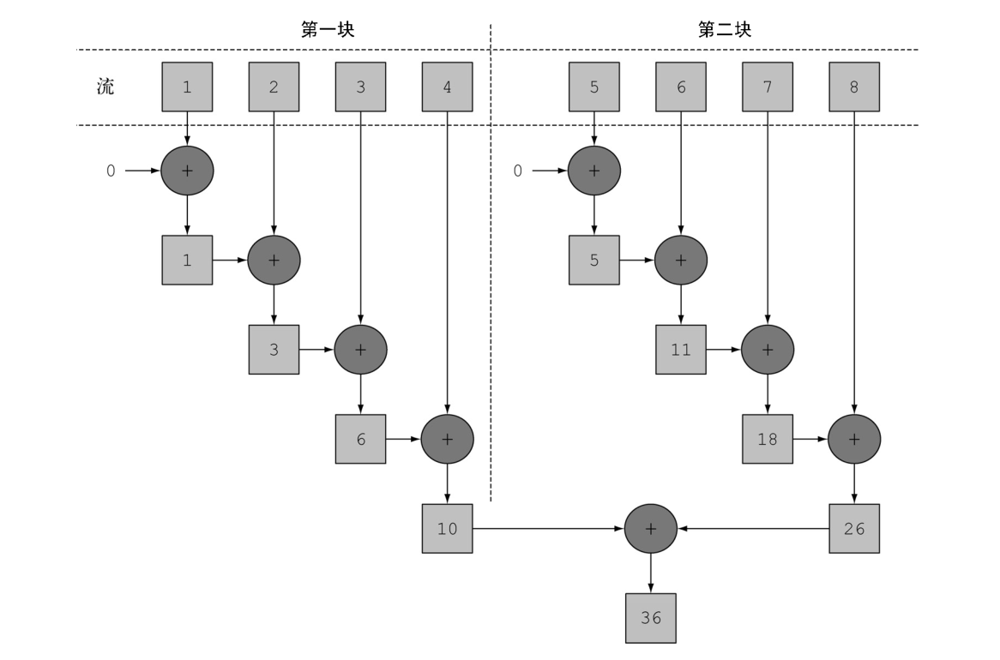
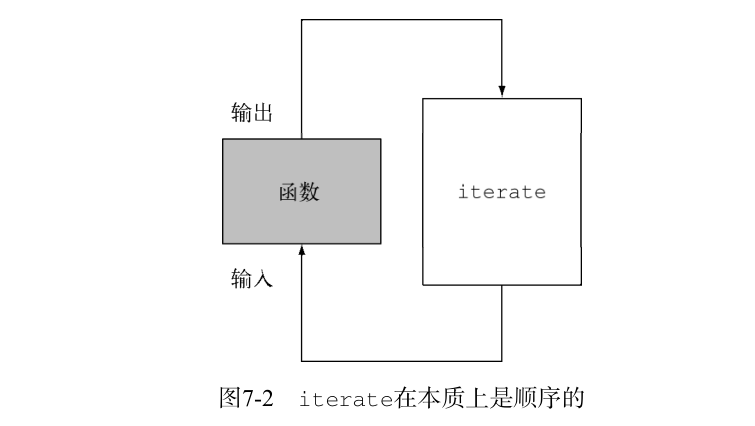
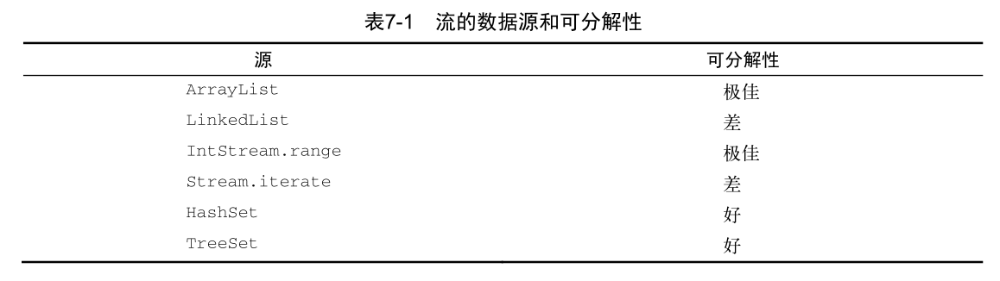

# 并行流

在java7之前,处理并行数据非常麻烦.
第一:你得明确的把包含的数据结构分成若干子部分.
第二:你要给每个子部分分配独立的线程.
第三:你需要在恰当的时候对他们进行同步,来避免不希望出现的竞争条件,等待所有线程完成,最后把这些结果合并起来.

在前面的文章中,我们介绍了 Stream接口,让你可以很方便的处理它的元素,可以调用ParallelStream 方法把集合转换成并行流.

并行流就是把一个内容分成多个数据块,并用不同线程分别处理每个数据块的流.

这样一来,你就可以把给定的工作负荷自动分配给多个处理器内核,让他们都忙起来.

假设你需要写一个方法，接受数字n作为参数，并返回从1到给定参数的所有数字的和。一个
直接（也许有点土）的方法是生成一个无穷大的数字流，把它限制到给定的数目，然后用对两个
数字求和的 BinaryOperator 来归约这个流，如下所示：

```java
//顺序
    public static Long sequentialSum(Long n){
        return Stream.iterate(1L, i->i+1L)
                .limit(n)
                .reduce(0L,Long::sum);
    }
```
用更为传统的Java术语来说，这段代码与下面的迭代等价
```java
 //传统迭代
    public static Long iterativeSum(Long n){
        Long result = 0L;
        for (Long i=1L;i<n;i++){
            result = result+i;
        }
        return result;
    }

```
这似乎是利用并行流的好机会,特别是n很大的时候,那该怎样做呢? 

你要对结果变量进行同步吗？用多少个线程呢？谁负责生成数呢？谁来做加法呢？

其实根本不必担心,并行流已经帮我们做完了这些令人头疼的工作

# 将顺序流转换为并行流

```java
//并行流
    public static Long parallelSum(Long n){
        return Stream.iterate(1L,i->i+1L)
                .limit(n)
                .parallel()
                .reduce(0L,Long::sum);
    }
```

在现实中，对顺序流调用 parallel 方法并不意味着流本身有任何实际的变化。它
在内部实际上就是设了一个 boolean 标志，表示你想让调用 parallel 之后进行的所有操作都并
行执行.类似地，你只需要对并行流调用 sequential 方法就可以把它变成顺序流.

## 测量流性能

我们说并行求和的方法应该比顺序迭代的方法更好.但在软件工程上, 靠猜绝对不是什么好办法,有时候经验也靠不住.
你应该始终遵循三个黄金规则;测量,测量,再测量.

为了简化测量,我们写个方法,专门用来测试 ParallelStreams类里的三个求和方法: sequentialSum iterativeSum, parallelSum.

```java
 public Long measureSumPref(Function<Long, Long> addr, Long n) {
        long fastest = Long.MAX_VALUE;
        for (int i = 0; i < 10; i++) {
            Long start = System.nanoTime();
            Long sum = addr.apply(n);
            Long druation = (System.nanoTime() - start)/1000000;
            if (druation < fastest) {
                fastest = druation;
            }
        }
        return fastest;

    }
```

这个方法会接收一个函数和一个Long类型参数.它会对传给方法的参数应用函数10次,记录每次执行的时间.

下面是测试结果
```java

    //顺序
    @Test
    public void test4() {
        Long fast = measureSumPref(ParallelStreams::sequentialSum, 1000 * 10000L);
        System.out.println("sequentialSum= " + fast);//398毫秒


    }

    //迭代
    @Test
    public void test5() {
        Long fast = measureSumPref(ParallelStreams::iterativeSum, 1000 * 10000L);
        System.out.println("iterativeSum= "+ fast);//153毫秒


    }
    //并行
    @Test
    public void test6(){
        Long fast = measureSumPref(ParallelStreams::parallelSum, 1000 * 10000L);
        System.out.println("parallelSum= "+fast);//1309毫秒
    }
```
看到结果,我们发现并行流操作相当令我们失望.

求和方法的并行版本比顺序版本要慢很多!!! 其实对这个意外的结果,有两方面的原因:

* 一:iterate 生成的是装箱对象,必须拆箱成数字才能求和.

* 二:我们很难把iterate分成多个独立的块来执行.

对于第二个问题,很有意思,我们直觉上可能是这样运行的,如图:



但是,iterate 很难分割成能够独立执行的小块，因为每次应用这个函数都要依赖前一次应用的结果


也就是说,整张数字表在归纳过程开始时还没准备好,因为Stream在遇到终端操作才会开始执行,因而无法有效的把流划分为小块进行处理.
把流标记为并行,其实是给顺序处理增加了开销,它还要把每次求和操作的结果分到一个不同的线程上.

这就说明了并行编程肯能很复杂,如果用得不对（比如采用了一个不易并行化的操作，如 iterate ），它甚至可能让程序的整体性能更差.
所以在调用那个看似神奇的 parallel 操作时，了解背后到底发生了什么是很有必要的。

## 并行流使用注意事项:使用更有针对性的方法

对于上面那种出人意料的结果,我们万不可把锅退给并行流,其实仔细分析,不难发现,这是我们使用了不恰当的的数据结构导致的.

对于上面的并行处理操作,我们可做如下改进.在之前的文章中,我们介绍过一个叫LongStream的流.这个流有个专门针对Long型的方法

* LongStream.rangeClosed 直接产生原始类型的long数字,没有装箱拆箱的开销.
* LongStream.rangeClosed 会生成数字范围,很容易查分为独立的小块.


LongStream和Stream一样都继承了BaseStream

```java
public interface LongStream extends BaseStream<Long, LongStream> {...}

public interface Stream<T> extends BaseStream<T, Stream<T>> {...}
```
这两个流的用法基本完全相同,唯一的不同相比从名字就能看出来,LongStream 指明了流类型为Long,类似的还有,IntStream,DoubleStream等

我们改进代码如下:

```java
 //顺序流改进版 LongStream.rangeClosed
    public static Long sequentialSum2(Long n) {
        return LongStream.rangeClosed(1, n)
                .reduce(0L,Long::sum);

    }
    
 //并行流改进版
    public static Long paraparallelSum2(Long n) {
        return LongStream.rangeClosed(1, n)
                .parallel()
                .reduce(0L,Long::sum);

    }
```

然后再次进行测量

```java
  //顺序流(改进版)
    @Test
    public void test7(){
        Long fast = measureSumPref(ParallelStreams::sequentialSum2, 1000 * 10000L);
        System.out.println("顺序流(改进版)="+fast);//56毫秒------改进之前:398毫秒

    }


    //并行流(改进版)
    @Test
    public void test8(){
        Long fast = measureSumPref(ParallelStreams::paraparallelSum2, 1000 * 10000L);
        System.out.println("并行流(改进版)="+fast);//14毫秒--------改进之前:1309毫秒

    }
```

由此结果可得出结论:

* 使用LongStream比iterate效率提高 710%

* 在上面基础上使用 并行流 比 顺序流 效率提高 400%

**可见:选择适当的数据结构往往比并行算法正重要,使用正确的数据结构后再选择并行算法能保证最佳的性能.**

>尽管如此,我们也必须知道,并行化不是没有代价的.并行化本身需要对流做递归划分,把每个子流的归纳操作分配到不同的线程,然后把这些操作的结果合并成一个值.
但在多个内核之间移动数据的代价也可能比你想的要大,所以在使用并行操作很重要的一点就是要保证并行执行的工作时间要比数据在内核之前移动的时间要长.

在使用并行Stream加速代码之前,你必须确保用的对,如果用错了,算得快就毫无意义了.让我们看一个常见的陷阱.

## 高效使用并行流

* 如果有疑问，测量。把顺序流转成并行流轻而易举，但却不一定是好事

* 留意装箱。自动装箱和拆箱操作会大大降低性能。Java 8中有原始类型流（ IntStream 、
  LongStream 、 DoubleStream ）来避免这种操作，但凡有可能都应该用这些流
  
* 有些操作本身在并行流上的性能就比顺序流差。特别是 limit 和 findFirst 等依赖于元
  素顺序的操作，它们在并行流上执行的代价非常大。例如， findAny 会比 findFirst 性
  能好，因为它不一定要按顺序来执行。

* 还要考虑流的操作流水线的总计算成本。设N是要处理的元素的总数，Q是一个元素通过
  流水线的大致处理成本，则N*Q就是这个对成本的一个粗略的定性估计。Q值较高就意味
  着使用并行流时性能好的可能性比较大。
  
* 对于较小的数据量，选择并行流几乎从来都不是一个好的决定。并行处理少数几个元素
  的好处还抵不上并行化造成的额外开销
  
* 要考虑流背后的数据结构是否易于分解。例如， ArrayList 的拆分效率比 LinkedList
  高得多，因为前者用不着遍历就可以平均拆分，而后者则必须遍历
  
*  还要考虑终端操作中合并步骤的代价是大是小（例如 Collector 中的 combiner 方法）



**需要强调的是:并行流背后使用的基础架构是java7引入的分支/合并框架.我们想要正确高效的使用并行流,了解它的内部原理至关重要.**

## [分支/合并框架](分支-合并框架.md)


## Spliterator


Spliterator 是Java 8中加入的另一个新接口；这个名字代表“可分迭代器”（splitable
iterator）。和 Iterator 一样， Spliterator 也用于遍历数据源中的元素，但它是为了并行执行
而设计的。虽然在实践中可能用不着自己开发 Spliterator ，但了解一下它的实现方式会让你
对并行流的工作原理有更深入的了解。Java 8已经为集合框架中包含的所有数据结构提供了一个
默认的 Spliterator 实现。

## 小结:

*  内部迭代让你可以并行处理一个流，而无需在代码中显式使用和协调不同的线程。

*  虽然并行处理一个流很容易，却不能保证程序在所有情况下都运行得更快。并行软件的
  行为和性能有时是违反直觉的，因此一定要测量，确保你并没有把程序拖得更慢。
  
* 从性能角度来看，使用正确的数据结构，如尽可能利用原始流而不是一般化的流，几乎
  总是比尝试并行化某些操作更为重要
  
* 分支/合并框架让你得以用递归方式将可以并行的任务拆分成更小的任务，在不同的线程
  上执行，然后将各个子任务的结果合并起来生成整体结果
  
* Spliterator 定义了并行流如何拆分它要遍历的数据。


