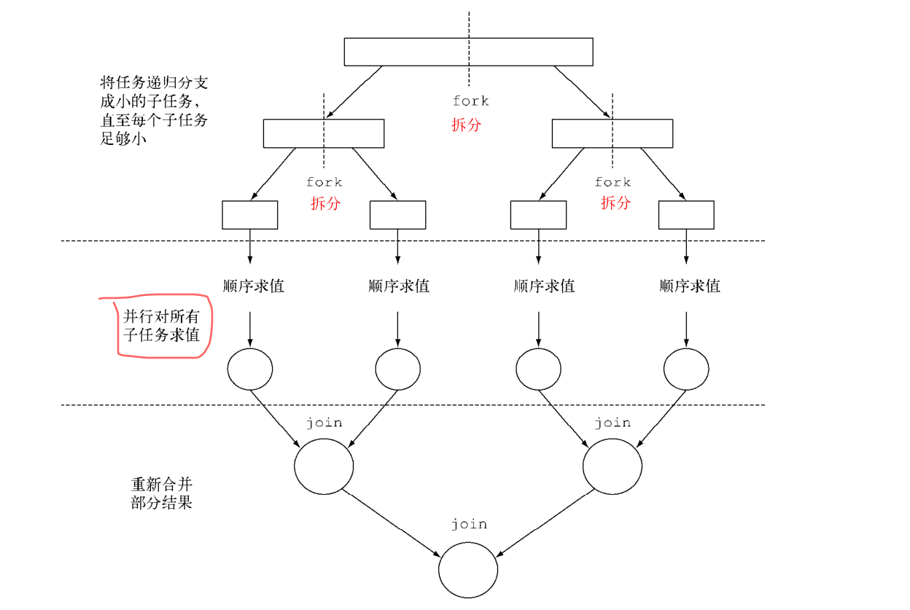
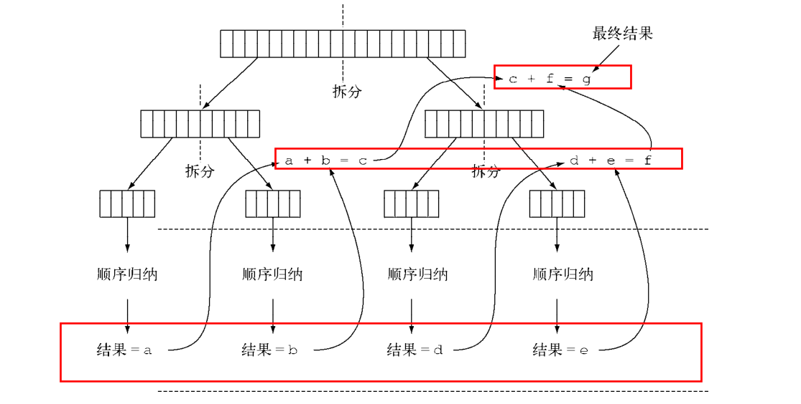
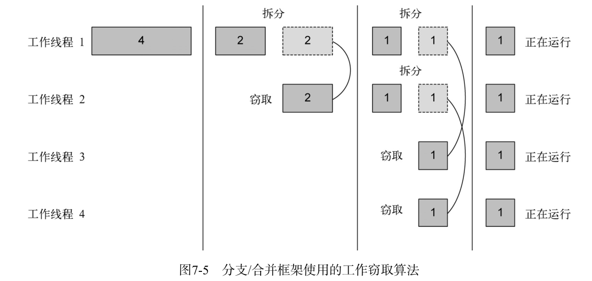

# 分支/合并框架详解

**分支框架的目的是以递归的方式将可以并行的任务拆分成更小的任务,然后将每个子任务的结果合并起来生成整体结果.**

它是 ExecutorService 接口的一个实现,他把子任务分配给线程池(ForkJoinPool)中的线程.


## 使用 RecursiveTask

要把任务提交到池,必须创建 RecursiveTask<V> 的一个子类,其中V是并行化任务产生的结果类型,

RecursiveTask类源码:
```java
public abstract class RecursiveTask<V> extends ForkJoinTask<V> {
    private static final long serialVersionUID = 5232453952276485270L;

    /**
     * The result of the computation.
     */
    V result;

    /**
     * The main computation performed by this task.
     * @return the result of the computation
     */
    protected abstract V compute();

    public final V getRawResult() {
        return result;
    }

    protected final void setRawResult(V value) {
        result = value;
    }

    /**
     * Implements execution conventions for RecursiveTask.
     */
    protected final boolean exec() {
        result = compute();
        return true;
    }

}
```

要定义 RecursiveTask， 只需实现它唯一的抽象方法compute ：

```java
@Override
    protected Long compute() {

        return null;
    }
```

**这个方法定义了将任务拆分成子任务的逻辑,以及无法再拆分或不便再拆分,生成单个子任务结果的逻辑.**


即(伪代码如下):
```java
if (任务足够小或不可分) {
    顺序计算该任务
} else {
    将任务分成两个子任务
    递归调用本方法，拆分每个子任务，等待所有子任务完成
    合并每个子任务的结果
}
```

递归的任务拆分过程如图:



如果你了解著名的分治算法,会发现这不过是分支算法的并行版本而已.

接下来我们举一个用分支/合并框架的实际例子，还以前面的例子为基础，让我们试着用这个框架为一个数字范围（这里用一个long[] 数组表示）求和

```java
/**
 * 分支合并框架测试
 *
 * @author itguang
 * @create 2017-11-18 14:22
 **/
public class ForkJoinTest extends RecursiveTask<Long> {

    //要处理的任务数组
    private final long[] numbers;

    //子任务处理数组的起始和结束位置
    private final int start;
    private final int end;

    //阀值,当数组小于10000就并行执行
    public static final long THRESHOLD = 10000;

    //公共构造函数,用于创建子任务


    //私有构造函数,用于 以递归方式为主任务创建子任务
    public ForkJoinTest(long[] numbers, int start, int end) {
        this.numbers = numbers;
        this.start = start;
        this.end = end;
    }

    public ForkJoinTest(long[] numbers) {
        this(numbers, 0, numbers.length);
    }


    @Override
    protected Long compute() {
        int length = end - start;

        //如果大小小于等于阀值,则顺序计算结果
        if (length <= THRESHOLD) {
            return computeSequentially();
        }

        //否则,创建一个子任务为数组的前一半求和
        ForkJoinTest leftTask = new ForkJoinTest(numbers, start, start + length / 2);
        //利用另一个 ForkJoinPool 里的线程异步执行新创建的子任务.
        leftTask.fork();//对子任务调用 fork 方法可以把它排进 ForkJoinPool 。
        //创建一个任务为数组的后一半求和
        ForkJoinTest rightTask = new ForkJoinTest(numbers, start + length / 2, end);
        //**递归操作**
        long rightResult = rightTask.compute();


        //遇到递归终止条件,读取本次递归第一个子任务的结果,如果尚未完成就等待
        long leftResult = leftTask.join();

        //递归累加
        return leftResult+rightResult;
    }

    //计算和
    private long computeSequentially() {

        long sum = 0;
        for (int i = start; i < end; i++) {

                sum += numbers[i];
            }
            return sum;
    }


}
```

测试:创建一个 ForkJoinPool,并把任务传递给它的invoke()方法.在ForkPool中执行时,返回结果就是ForkJoinTest的并行递归求和结果

```java
 @Test
    public void test9(){
        long[] numbers = LongStream.rangeClosed(1, 1000*10000).toArray();
        ForkJoinTest forkJoinTest = new ForkJoinTest(numbers);
        Long sum = new ForkJoinPool().invoke(forkJoinTest);
        System.out.println(sum);//50000005000000

    }
```


请注意在实际应用时，使用多个 ForkJoinPool 是没有什么意义的。正是出于这个原因，一
般来说把它实例化一次，然后把实例保存在静态字段中，使之成为单例，这样就可以在软件中任
何部分方便地重用了。这里创建时用了其默认的无参数构造函数，这意味着想让线程池使用JVM
能够使用的所有处理器。更确切地说，该构造函数将使用 Runtime.availableProcessors 的
返回值来决定线程池使用的线程数。请注意 availableProcessors 方法虽然看起来是处理器，
但它实际上返回的是可用内核的数量，包括超线程生成的虚拟内核。

当把一个ForkJoinTask 任务交给ForkJoinPool时,这个任务就由池中的一个线程执行,这个线程会调用任务的 compute 方法.
该方法会检查任务是否小到足以顺序执行，如果不够小则会把要求和的数组分成两半，分给两个新的 ForkJoinTest ，而它们也由ForkJoinPool 安排执行.

因此这一过程可以递归重复,把原任务拆分成更小的任务执行,知道满足不可炒粉的条件,在上例中是拆分数组的大小小于阀值.
这时候会从递归终止开始顺序计算每个任务的结果.然后由分支创建的二叉树遍历回它的根.接下来会合并每个子任务的部分结果，从而得到总任务的结果.

如图:




## 使用分支/合并框架的最佳做法

* 对一个任务调用 join 方法会阻塞调用方，直到该任务做出结果。因此，有必要在两个子
  任务的计算都开始之后再调用它。否则，你得到的版本会比原始的顺序算法更慢更复杂，
  因为每个子任务都必须等待另一个子任务完成才能启动。
  
* 不应该在 RecursiveTask 内部使用 ForkJoinPool 的 invoke 方法。相反，你应该始终直
  接调用 compute 或 fork 方法，只有顺序代码才应该用 invoke 来启动并行计算。
  
* 对子任务调用 fork 方法可以把它排进 ForkJoinPool 。同时对左边和右边的子任务调用
  它似乎很自然，但这样做的效率要比直接对其中一个调用 compute 低。这样做你可以为
  其中一个子任务重用同一线程，从而避免在线程池中多分配一个任务造成的开销
  
* 和并行流一样，你不应理所当然地认为在多核处理器上使用分支/合并框架就比顺序计
  算快。我们已经说过，一个任务可以分解成多个独立的子任务，才能让性能在并行化时
  有所提升。所有这些子任务的运行时间都应该比分出新任务所花的时间长；一个惯用方
  法是把输入/输出放在一个子任务里，计算放在另一个里，这样计算就可以和输入/输出
  同时进行。此外，在比较同一算法的顺序和并行版本的性能时还有别的因素要考虑。就
  像任何其他Java代码一样，分支/合并框架需要“预热”或者说要执行几遍才会被JIT编
  译器优化。这就是为什么在测量性能之前跑几遍程序很重要，我们的测试框架就是这么
  做的。同时还要知道，编译器内置的优化可能会为顺序版本带来一些优势（例如执行死
  码分析——删去从未被使用的计算）。
  
  
## ForkJoinTask工作窃取算法

在 ForkJoinSumCalculator 的例子中，我们决定在要求和的数组中最多包含10 000个项目
时就不再创建子任务了。这个选择是很随意的，但大多数情况下也很难找到一个好的启发式方法
来确定它，只能试几个不同的值来尝试优化它。在我们的测试案例中，我们先用了一个有1000
万项目的数组，意味着 ForkJoinSumCalculator 至少会分出1000个子任务来。这似乎有点浪费
资源，因为我们用来运行它的机器上只有四个内核。在这个特定例子中可能确实是这样，因为所
有的任务都受CPU约束，预计所花的时间也差不多。

但分出大量的小任务一般来说都是一个好的选择。这是因为，理想情况下，划分并行任务时，
应该让每个任务都用完全相同的时间完成，让所有的CPU内核都同样繁忙。不幸的是，实际中，每
个子任务所花的时间可能天差地别，要么是因为划分策略效率低，要么是有不可预知的原因，比如
磁盘访问慢，或是需要和外部服务协调执行。


分支/合并框架工程用一种称为工作窃取（work stealing）的技术来解决这个问题。在实际应
用中，这意味着这些任务差不多被平均分配到 ForkJoinPool 中的所有线程上。每个线程都为分
配给它的任务保存一个双向链式队列，每完成一个任务，就会从队列头上取出下一个任务开始执
行。基于前面所述的原因，某个线程可能早早完成了分配给它的所有任务，也就是它的队列已经
空了，而其他的线程还很忙。这时，这个线程并没有闲下来，而是随机选了一个别的线程，从队
列的尾巴上“偷走”一个任务。这个过程一直继续下去，直到所有的任务都执行完毕，所有的队
列都清空。这就是为什么要划成许多小任务而不是少数几个大任务，这有助于更好地在工作线程
之间平衡负载。

一般来说，这种工作窃取算法用于在池中的工作线程之间重新分配和平衡任务。如图展示
了这个过程。当工作线程队列中有一个任务被分成两个子任务时，一个子任务就被闲置的工作线
程“偷走”了。如前所述，这个过程可以不断递归，直到规定子任务应顺序执行的条件为真。




