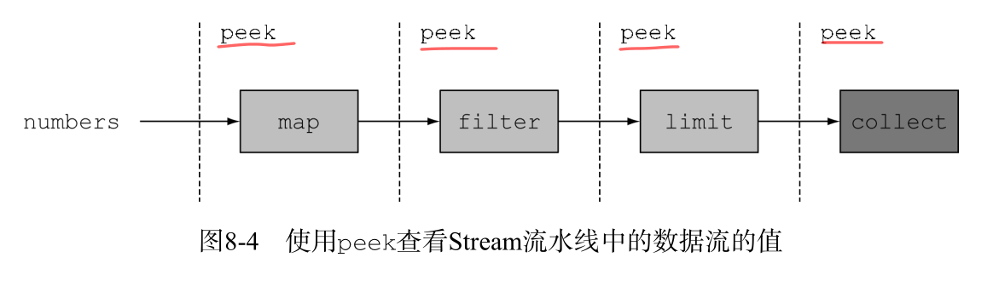

# 使用Lambda重构面向对象的设计模式

## 查看栈跟踪

## 流操作调试技巧

**peeek:偷看；一瞥，看一眼**

假设你试图对流操作中的流水线进行调试，该从何入手呢？你可以像下面的例子那样，使用
forEach 将流操作的结果日志输出到屏幕上或者记录到日志文件中：

```java
 @org.junit.Test
    public void test(){
       List<Integer> numbers = Arrays.asList(2, 3, 4, 5);
       numbers.stream()
               .map(x->x+17)
               .filter(x->x%2==0)
               .limit(3)
               .forEach(System.out::println);

    }
```
这段代码的输出如下：

        20
        22

通过前面的介绍我们知道,一旦调用 forEach 这个终端操作,这个流就会立即执行,但是如果我们想要知道在某个流操作(比如:map,filter,limit)前后流里面个参数的值该怎么办呢?

这就是流操作方法peek 大显身手的时候.peek的设计初衷,就是在流中每个元素进入下一个流操作之前,插入执行一个动作.

但它不像 forEach 那样回复整个流的运行,而是在一个流上完成一个操作之后,顺承到流水线中的下一个操作.

```java
 @org.junit.Test
    public void test2(){
       List<Integer> numbers = Arrays.asList(2, 3, 4, 5);
       numbers.stream()
               .peek(x-> System.out.println("from Stream:"+x))
               .map(x->x+17)
               .peek(x-> System.out.println("from map:"+x))
               .filter(x->x%2==0)
               .peek(x-> System.out.println("from filter:"+x))
               .limit(3)
               .peek(x-> System.out.println("from limit:"+x))
               .forEach(System.out::println);

    }
```
结果如下:

```
        from Stream:2
        from map:19
        from Stream:3
        from map:20
        from filter:20
        from limit:20
        20
        from Stream:4
        from map:21
        from Stream:5
        from map:22
        from filter:22
        from limit:22
        22

```
通过peek操作我们能清楚的了解到流水线中每一步的操作结果.




