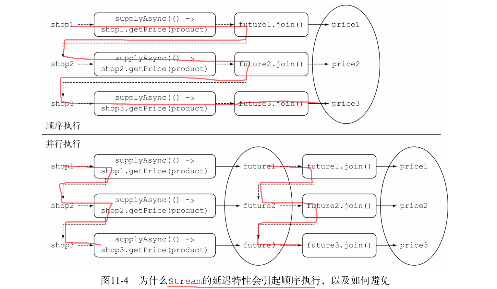
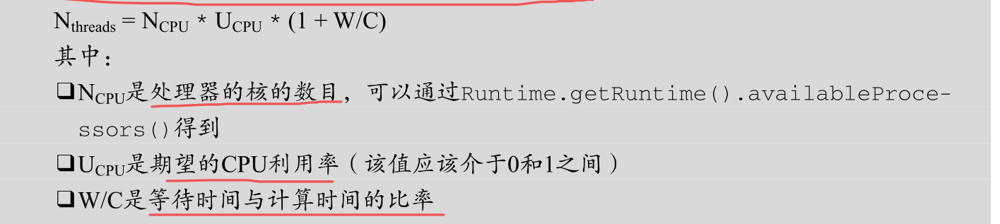
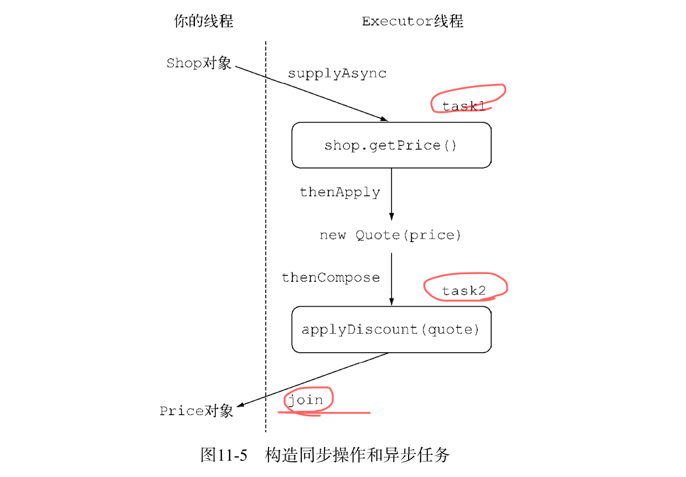
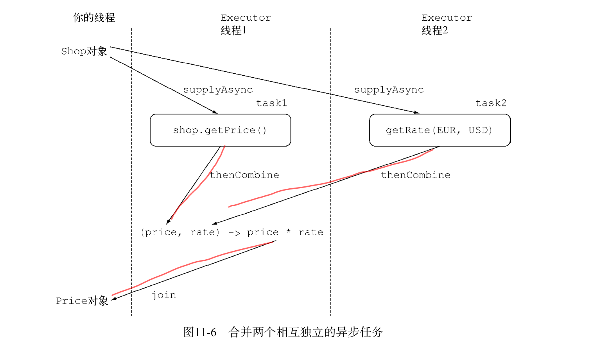

# <span id="jump">CompletableFuture 组合式异步编程</span>

本节内容:

* 创建异步计算并获取计算结果.
* 使用非阻塞操作提升吞吐量.
* 设计和实现异步API.
* 如何以异步的方式使用同步的API.
* 如何对两个或多个异步操作进行流水线和合并操作.
* 如何处理异步操作的完成状态.


现在，很少有网站或者网络应用会以完全隔离的方式工作。更多的时候，我们看到
的下一代网络应用都采用“混聚”（mash-up）的方式：它会使用来自多个来源的内容，将这些内
容聚合在一起，方便用户的生活。

可是，你并不希望因为等待某
些服务的响应，阻塞应用程序的运行，浪费数十亿宝贵的CPU时钟周期。

那么其实你真正想做的是避免因为等待远程服务的返回,或者对数据库的查询等,而阻塞 当前线程的执行,浪费宝贵的CPU资源,因为这种等待的时间很坑相当长.

通过本文你将会了解到java5中的Future接口和jav8中对它更加完善的CompletableFuture接口,


## Future接口

要使用Future,通常你只需要把耗时操作封装在一个Callable对象中,再把它交给 ExecutorService 就行了,下面这段代码展示了Java 8之前使用Future 的一个例子。

```java
ExecutorService executor = Executors.newCachedThreadPool();
    Future<Double> future = executor.submit(new Callable<Double>() {
        public Double call() {
            return doSomeLongComputation();
            }});
        doSomethingElse();
        try {
        Double result = future.get(1, TimeUnit.SECONDS);
        } catch (ExecutionException ee) {
        // 计算抛出一个异常
        } catch (InterruptedException ie) {
        // 当前线程在等待过程中被中断
        } catch (TimeoutException te) {
        // 在Future对象完成之前超过已过期
}
```

通过第一个例子，我们知道 Future 接口提供了方法来检测异步计算是否已经结束（使用
isDone 方法），等待异步操作结束，以及获取计算的结果。但是这些特性还不足以让你编写简洁
的并发代码。比如，我们很难表述 Future 结果之间的依赖性；从文字描述上这很简单，“当长时
间计算任务完成时，请将该计算的结果通知到另一个长时间运行的计算任务，这两个计算任务都
完成后，将计算的结果与另一个查询操作结果合并”。但是，使用 Future 中提供的方法完成这样
的操作又是另外一回事。这也是我们需要更具描述能力的特性的原因.

接下来,你会了解新的 CompletableFuture 类（它实现了 Future 接口）如何利用Java 8
的新特性以更直观的方式将上述需求都变为可能。 Stream 和 CompletableFuture 的设计都遵循
了类似的模式：它们都使用了Lambda表达式以及流水线的思想。从这个角度，你可以说
CompletableFuture 和 Future 的关系就跟 Stream 和 Collection 的关系一样。

## 使用 CompletableFuture 构建异步应用

为了展示 CompletableFuture 的强大特性，我们会创建一个名为“最佳价格查询器”
（best-price-finder）的应用，它会查询多个在线商店，依据给定的产品或服务找出最低的价格。

### 实现异步 API

为了实现最佳价格查询器应用，让我们从每个商店都应该提供的API定义入手。首先，商店
应该声明依据指定产品名称返回价格的方法：

```java
package completablefuture;

import java.util.concurrent.CompletableFuture;
import java.util.concurrent.Future;

/**
 * 每个商店都提供的对外访问的API
 * @author itguang
 * @create 2017-11-22 11:05
 **/
public class Shop {

    /**
     * 商店名称
     */
    private  String name;


    public Shop(String name) {
        this.name = name;
    }

    public String getName() {
        return name;
    }

    public void setName(String name) {
        this.name = name;
    }

    /**
     * (阻塞式)通过名称查询价格
     * @param product
     * @return
     */
    public double getPrice(String product) {
           return calculatePrice(product);
    }

   


    /**
     * 计算价格
     * @param product
     * @return
     */
    private double calculatePrice(String product){
        delay();
        //数字*字符=数字
        return 10*product.charAt(0);

    }


    /**
     * 模拟耗时操作,阻塞1秒
     */
    private void delay(){
        try {
            Thread.sleep(1000);
        } catch (InterruptedException e) {
            e.printStackTrace();
        }
    }

}

```


很明显，这个API的使用者（这个例子中为最佳价格查询器）调用该方法时，它会被
阻塞。为等待同步事件完成而等待1秒钟，这是无法接受的，尤其是考虑到最佳价格查询器对
网络中的所有商店都要重复这种操作。

本章接下来的小节中，你会了解如何以异步方式使用同步API解决这个问题。

### 将同步方法转化为异步方法

在上面的Shop服务类中添加异步计算价格的方法:

```java
 /**
     * (非阻塞式)异步获取价格
     * @param product
     * @return
     */
    public Future<Double> getPriceAsync(String product){
        CompletableFuture<Double> future = new CompletableFuture<>();
        new Thread(()->{
            double price = calculatePrice(product);
            //需要长时间计算的任务结束并返回结果时,设置Future返回值
            future.complete(price);
        }).start();

        //无需等待还没结束的计算,直接返回Future对象
        return future;
    }
```

上面的代码我们可以看出,我们模拟了一个计算价格的耗时操作 calculatePrice(String product),接收一个商品名称作为参数,
还有一个异步的API getPriceAsync(String product),改方法创建了一个代表异步计算的 CompletableFuture 对象实例,它在计算完成后会包含计算结果.
当请求的产品价格最终计算得出时,你可以使用 complete 方法,结束CompletableFuture 对象的运行,并设置变量的值.


接下来我们开始调用上面的API服务实现我们的商品比价器:

```java
 package future;
 
 import completablefuture.Shop;
 import org.junit.Test;
 
 import java.util.concurrent.ExecutionException;
 import java.util.concurrent.Future;
 
 /**
  * @author itguang
  * @create 2017-11-22 10:54
  **/
 public class FutureDemo {
 
 
     /**
      * 测试同步API
      */
     @Test
     public void testgetPrice(){
         Shop shop = new Shop("Best Shop");
         long start = System.nanoTime();
         double price = shop.getPrice("mac book pro");
         System.out.printf(shop.getName()+" Price is %.2f%n",price);
         long invocationTime = (System.nanoTime()-start)/1_000_000;
         System.out.println("同步方法调用花费时间:--- "+invocationTime+" --- msecs");
 
 
         //...其他操作
         doSomethingElse();
 
 
         long retrievalTime = (System.nanoTime()-start)/1_000_000;
         System.out.println("同步方法返回价格所需时间: --- "+retrievalTime+" ---msecs");
 
     }
 
 
     /**
      * 测试异步API
      */
     @Test
     public void testAsync(){
         Shop shop = new Shop("Best Shop");
         long start = System.nanoTime();
         Future<Double> futurePrice = shop.getPriceAsync("mac book pro");
         long invocationTime = (System.nanoTime()-start)/1_000_000;
         System.out.println("异步方法调用花费时间: --- "+invocationTime+" --- msecs");
 
 
         //...其他操作
         doSomethingElse();
 
         //从future对象中读取价格,如果价格未知,则发生阻塞.
         try {
             Double price = futurePrice.get();
             System.out.printf(shop.getName()+" Price is %.2f%n",price);
         } catch (InterruptedException e) {
             e.printStackTrace();
         } catch (ExecutionException e) {
             e.printStackTrace();
         }
 
         long retrievalTime = (System.nanoTime()-start)/1_000_000;
         System.out.println("异步方法返回价格所需时间: --- "+retrievalTime+" ---msecs");
 
     }
 
 
 
 
     /**
      * 其它操作
      */
     public static void doSomethingElse(){
          try {
                     Thread.sleep(1_000);
                 } catch (InterruptedException e) {
                     e.printStackTrace();
                 }
 
     }
 
 
 }

```

测试结果:

```
同步方法调用花费时间:--- 1000 --- msecs
同步方法返回价格所需时间: --- 2000 ---msecs

----------------

异步方法调用花费时间: --- 29 --- msecs
异步方法返回价格所需时间: --- 1035 ---msecs
```
由此可见:同步方法使用阻塞时编程获取商品价格,异步方法采用非阻塞式编程获取商品价格,在调用异步方法 getPriceAsync后,立即返回一个Future对象,
通过该对象在将来的某个时刻取得商品的价格,这种情况下,客户在进行商品价格查询的同时,还能执行一些其它的操作.而同步方法调用,必须等到同步方法完成后才能进行其它操作

### 错误处理

现在我们考虑这样一种情况,假设计算价格的方法出现了错误,会怎样呢?

* 对于同步线程来说会直接抛出一个异常,并终止当前线程的运行.
* 对于异步线程来说,就非常糟糕了,异常会被限制在计算价格的那个异步线程中,**当异步线程抛出 未经捕获的异常 时**,
  该线程就会被杀死,而这会导致等待get()方法返回结果的客户端永久性被阻塞.

接下来我们测试一下:修改Shop类的 calculatePrice方法如下,

```java
 /**
     * 计算价格(模拟一个产生价格的方法)
     * @param product
     * @return
     */
    private double calculatePrice(String product){
        delay();

            int i=  1/0;//故意抛出 java.lang.ArithmeticException: / by zero 异常

        //数字*字符=数字(产生价格的方法)
        return 10*product.charAt(0);

    }
```

再次测试会发现,客户端会收到一个异常信息:
            
            java.lang.ArithmeticException: / by zero
                at completablefuture.Shop.calculatePrice(Shop.java:70)
                at completablefuture.Shop.lambda$getPriceAsync$0(Shop.java:49)
                at java.lang.Thread.run(Thread.java:748)


## 使用工厂方法 supplyAsync 创建 CompletableFuture 对象.

 CompletableFuture 类自
身提供了大量精巧的工厂方法，使用这些方法能更容易地完成整个流程，还不用担心实现的细节。

你可以用一行语句重写方法 getPriceAsync
```java
 /**
     * 使用静态工厂supplyAsync(非阻塞式)异步获取价格
     * @param product
     * @return
     */
    public Future<Double> getPriceAsync(String product){
        CompletableFuture<Double> future = CompletableFuture.supplyAsync(() -> calculatePrice(product));

        //无需等待还没结束的计算,直接返回Future对象
        return future;
    }
```
supplyAsync 方法接受一个生产者（ Supplier ）作为参数，返回一个 CompletableFuture
对象，该对象完成异步执行后会读取调用生产者方法的返回值。生产者方法会交由 ForkJoinPool
池中的某个执行线程（ Executor ）运行，但是你也可以使用 supplyAsync 方法的重载版本，传
递第二个参数指定不同的执行线程执行生产者方法。一般而言，向 CompletableFuture 的工厂
方法传递可选参数，指定生产者方法的执行线程是可行的,在后面我们会使用这一方法.


## 让你的代码免受阻塞之苦

接下来,为了介绍如何拜托代码阻塞带来的烦恼,我们假设Shop API的代码实现你是不能更改的.其实这样也合理,我们肯定不能控制服务提供方修改他们的代码.

现在假设Shop APi提供的方法都是同步阻塞式的,这也是当你试图使用 HTTP API 提供的服务最长发生的事情.

下面你会学到如何以异步的方式查询多个商店，避免被单一的请求所阻塞，并由此提升你的“最佳价格查询器”的性能和吞吐量

现在我们重修改Shop类
```java
package completablefuture;

import java.util.List;
import java.util.Random;
import java.util.concurrent.CompletableFuture;
import java.util.concurrent.Future;

/**
 * 每个商店都提供的对外访问的API
 * @author itguang
 * @create 2017-11-22 11:05
 **/
public class Shop {

    /**
     * 商店名称
     */
    private  String name;
    private Random random = new Random();


    public Shop(String name) {
        this.name = name;
    }

    public String getName() {
        return name;
    }

    /**
     * (阻塞式)通过名称查询价格
     * @param product
     * @return
     */
    public double getPrice(String product) {
           return calculatePrice(product);
    }

    /**
     * 计算价格(模拟一个产生价格的方法)
     * @param product
     * @return
     */
    private double calculatePrice(String product){
        delay();
        //数字*字符=数字(产生价格的方法)
        return random.nextDouble()*product.charAt(0)*product.charAt(1);
    }


    /**
     * 模拟耗时操作,阻塞1秒
     */
    private void delay(){
        try {
            Thread.sleep(1_000);
        } catch (InterruptedException e) {
            e.printStackTrace();
        }
    }

}

```

客户端代码:

```java
/**
 * 让你的代码免受阻塞之苦
 *
 * @author itguang
 * @create 2017-11-21 16:50
 **/
public class ClientTest {

    List<Shop> shops;

    @Before
    public void before() {
        shops = Arrays.asList(new Shop("淘宝"),
                new Shop("天猫"),
                new Shop("京东"),
                new Shop("亚马逊"));

    }


    

    /**
     * 
     * @param product 商品名称
     * @return 根据名字返回每个商店的商品价格
     */
    public List<String> findPrice(String product) {
       

        return list;
    }


}
```
我们有一个商店列表 shops,和一个 findPrice 方法.

### 采用顺序查询所有商店的方式实现的 findPrices 方法

首先,我们最先想到的应该是采用顺序查询所有商店的方式实现的 findPrices 方法.

```java
/**
 * 让你的代码免受阻塞之苦
 *
 * @author itguang
 * @create 2017-11-21 16:50
 **/
public class ClientTest {

    List<Shop> shops;

    @Before
    public void before() {
        shops = Arrays.asList(new Shop("淘宝"),
                new Shop("天猫"),
                new Shop("京东"),
                new Shop("亚马逊"));

    }

   /**
     * 采用顺序查询所有商店的方式实现的 findPrices 方法
     * @param product
     * @return
     */
    public List<String> findPrice(String product) {
        List<String> list = shops.stream()
                .map(shop ->
                        String.format("%s price is %.2f RMB",
                                shop.getName(),
                                shop.getPrice(product)))

                .collect(toList());

        return list;
    }

    /**
     *采用顺序查询所有商店的方式实现的 findPrices 方法,查询每个商店里的 iphone666s
     */
    @Test
    public void test() {
        long start = System.nanoTime();
        
        List<String> list = findPrice("iphone666s");
        
        System.out.println(list);
        System.out.println("Done in "+(System.nanoTime()-start)/1_000_000+" ms");
    }

    
}

```

测试结果:

        [淘宝 price is 7013.15 RMB, 天猫 price is 6248.79 RMB, 京东 price is 4902.47 RMB, 亚马逊 price is 2700.63 RMB]
        Done in 4043 ms

正如我们所料,由于对每个商店的查询都是阻塞式的,并且每个查询都花费大约1秒,4个商店的查询是顺序的,一个查询操作会阻塞另一个.

### 使用并行流对请求进行并行操作

为了对以上代码进行改进,我们很容易想到使用并行流进行并行操作.可能也是最快的改善方法是使用并行流来避免顺序计算，
如下所示:

```java
/**
     * 使用并行流对请求进行并行操作
     * @param product
     * @return
     */
    public List<String> findPrice2(String product) {
        List<String> list = shops.parallelStream()
                .map(shop ->
                        String.format("%s price is %.2f RMB",
                                shop.getName(),
                                shop.getPrice(product)))

                .collect(toList());

        return list;
    }
```

测试结果:

        [淘宝 price is 7296.22 RMB, 天猫 price is 3504.13 RMB, 京东 price is 8173.09 RMB, 亚马逊 price is 4015.44 RMB]
        Done in 1037 ms

效果立竿见影,看起来改为并行流确实是个简单有效的的操作:现在对四个不同商店的查询实行了并行操作,所以完成所有操作的总和只有1秒多一点.


### 使用 CompletableFuture 发起异步请求

让我们尝试使用刚学过的CompletableFuture ，将 findPrices 方法中对不同商店的同步调用替换为异步调用

```java
   /**
     * 使用 CompletableFuture 发起异步请求
     * @param product
     * @return
     */
    public List<String> findPrice3(String product) {
        List<CompletableFuture<String>> futures = shops.stream()
                .map(shop -> CompletableFuture.supplyAsync(
                        () -> String.format("%s price is %.2f RMB",
                                shop.getName(),
                                shop.getPrice(product)))
                )
                .collect(toList());
        List<String> list = futures.stream()
                .map(CompletableFuture::join)
                .collect(toList());


        return list;
    }
```
在此,我们对上面的代码解释一下 CompletableFuture.join() 操作,
其实我们自需要知道CompletableFuture 类中的 join 方法和 Future 接口中的 get 有相同的含义，并且也声明在Future 接口中，
它们唯一的不同是 join 不会抛出任何检测到的异常。使用它你不再需要使用try / catch 语句块让你传递给第二个 map 方法的Lambda表达式变得过于臃肿

还有一点需要注意:这里使用了两个不同的 Stream 流水线，而不是在同一个处理流的流水线上一个接一个地放置两个 map 操作——这其实是有缘由的.

如果你在单一流水线中处理流,发向不同商家的请求只能以同步,顺序的方式才能执行成功.
这样一来,你的操作就相当于,每个ComletableFuture对象只能在前一个执行查询的操作后才能执行自己的查询操作,即通知join方法返回结果.下图清晰的表明了单一流水线和多流水线的执行过程:


图的上班部分展示了单一流水线的处理过程,我们看到执行的流程是顺序的(以虚线标识),即新的CompletableFuture对象只能在前一个操作完成之后才能创建.
与此相反,图的下半部分展示了如何先将CompletableFuture聚集到一个列表中,即以椭圆部分表示,然后转成另一个流,让对象们在其他对象完成操作之前就能启动.


接下来让我们看看使用 CompletableFuture 发起异步请求的测试结果:

        [淘宝 price is 4190.89 RMB, 天猫 price is 10398.09 RMB, 京东 price is 8776.79 RMB, 亚马逊 price is 2902.69 RMB]
        Done in 2044 ms

震惊!!!,有么有? 我们惊讶的发现,这次执行的结果比原生顺序执行快两倍,比并行流执行慢两倍,再一想到我们只用了最少最简单的改动把顺序流改为并行流,把时间提高了4倍,就更加让人沮丧.


**但是,这就是全部的真相吗? CompletableFuture 就这么不堪一击吗?还是我们可能漏掉了什么重要的东西,继续往下探究之前，让我们休息几分钟，尤其是想想你测试
                                                           代码的机器是否足以以并行方式运行四个线程。**


## 寻找更好的方案

对于上面出现的问题,我们分析一下:并行版本工作的很好,是因为它能并行的执行四个任务,所以它几乎能为每个商家分配一个线程.

但是，如果你想要增加第五个商家到商店列表中，让你的“最佳价格查询”应用
对其进行处理，这时会发生什么情况？

让我们看看增加一个商店后的测试结果:

```
顺序

[淘宝 price is 6596.20 RMB, 天猫 price is 1528.81 RMB, 京东 price is 2649.17 RMB, 亚马逊 price is 7780.31 RMB, 实体店 price is 2027.03 RMB]
Done in 5034 ms


并行

[淘宝 price is 9537.24 RMB, 天猫 price is 11233.77 RMB, 京东 price is 6580.67 RMB, 亚马逊 price is 2622.23 RMB, 实体店 price is 1528.11 RMB]
Done in 2038 ms


CompletableFuture

[淘宝 price is 8466.65 RMB, 天猫 price is 6883.22 RMB, 京东 price is 4990.85 RMB, 亚马逊 price is 2826.72 RMB, 实体店 price is 8278.86 RMB]
Done in 2043 ms


```
* 顺序执行版本的执行还是需要大约5秒多钟的时间,

* 并行流版本的程序这次比之前也多消耗了差不多1秒钟的时间,因为可以并行运行（通用线程池中处于可用状态的）的四个线程现在都处于繁忙状态，都在对前4个商店进行查
询。第五个查询只能等到前面某一个操作完成释放出空闲线程才能继续，

* CompletableFuture 版本的程序似乎比之前只慢那么一点儿,但是最后这个版本也不太令人满意。比如，如果你试图让你的代码处理9个商店，并行流版本耗时3143毫秒，
而 CompletableFuture 版本耗时3009毫秒。它们看起来不相伯仲，究其原因都一样：

**后两个版本他们内部采用的都是同样的线程池,默认都使用固定数目的线程,具体县城数量取决于  Runtime.getRuntime().availableProcessors() 的返回值**

**然而,CompletableFuture 具有一定的优势,因为他可以让你对 Execotor (执行器)进行配置,尤其是线程池的大小,让它以更适合应用需求的方式配置.这是并行流API无法提供的.**

让我们看看你怎样利用这种配置上的灵活性带来实际应用程序性能上的提升。

### 使用定制的 Executor 配置 CompletableFuture

就这个主题而言，明智的选择似乎是创建一个配有线程池的 Execotor,但是你应该如何选择合适的线程数目呢?

#### 调整线程池的大小

> 《Java并发编程实战》（http://mng.bz/979c）一书中，Brian Goetz和合著者们为线程池大小
  的优化提供了不少中肯的建议。这非常重要，**如果线程池中线程的数量过多,最终他们会竞争稀缺的处理器和内存资源,浪费大量的时间再上下文切换上.**
  **反之,如果线程数过少,正如我们上面的应用所面临的问题,处理器的一些核可能就无法充分利用.**
  Brian Goetz建议，线程池大
  小与处理器的利用率之比可以使用下面的公式进行估算：
  



我们的应用99% 的时间都在等待商店的响应,所以估算出 W/C 的比率为99/1,约为100,这意味这你期望CPU的利用率为 100%,如果你的处理器为4核,拿你要创建一个拥有400个线程的线程池,
实际操作中,如果你创建的线程数比商店的数目更多,反而是一种浪费,因为这样作之后,你线程池中的很大一部分线程根本没有机会被使用.

出于这种考虑，我们建议你将执行器使用的线程数，与你需要查询的商店数目设
定为同一个值，这样每个商店都应该对应一个服务线程。不过，为了避免发生由于商店的数目过
多导致服务器超负荷而崩溃，你还是需要设置一个上限，比如100个线程。

```java
 /**
     * 使用定制的 Executor 配置 CompletableFuture
     *
     * @param product
     * @return
     */
    public List<String> findPrice4(String product) {

        //为“最优价格查询器”应用定制的执行器 Execotor
        Executor executor = Executors.newFixedThreadPool(Math.min(shops.size(), 100),
                new ThreadFactory() {
                    @Override
                    public Thread newThread(Runnable r) {
                        Thread thread = new Thread(r);
                        //使用守护线程,使用这种方式不会组织程序的关停
                        thread.setDaemon(true);
                        return thread;
                    }
                }
        );

      //将执行器Execotor 作为第二个参数传递给 supplyAsync 工厂方法
        List<CompletableFuture<String>> futures = shops.stream()
                .map(shop -> CompletableFuture.supplyAsync(
                        () -> String.format("%s price is %.2f RMB",
                                shop.getName(),
                                shop.getPrice(product)), executor)
                )
                .collect(toList());
        List<String> list = futures.stream()
                .map(CompletableFuture::join)
                .collect(toList());


        return list;
    }
```

**注意:你现在创建的是一个由守护线程构建的线程池.java程序是没有办法终止或者退出一个正在运行的线程的,所以最后剩下的那个线程会由于一直等待无法发生的事件而引发问题**
**与此相反,如果将线程标记为守护线程,意味着程序退出时,它也会被回收.这二者之间没有性能之间的差异.**

改进之后,我们再来测试一下5个商品的列表:

测试结果:

        [淘宝 price is 3228.06 RMB, 天猫 price is 5183.54 RMB, 京东 price is 7699.38 RMB, 亚马逊 price is 4071.39 RMB, 实体店 price is 5394.59 RMB]
        Done in 1046 ms

使用 CompletableFuture 方案的程序处理5个商店仅耗时1021秒，处理9个商店
时耗时1022秒。一般而言，这种状态会一直持续，直到商店的数目达到我们之前计算的阈值400。

**这个例子证明了,要创建更适合你的应用特性的执行器.利用CompletableFuture像其提交任务执行是个不错的注意.处理需要大量并行的操作时,这几乎是最有效的策略**

## 思考:并行---使用并行流还是CompletableFuture ???

目前为止,你已经知道了,对于集合进行并行计算有两种方法:

* 要么将其转化为并行流,利用map这样的操作开展工作.

* 要么枚举出集合中的每一个元素,创建新的线程,在CompletableFuture内对其进行操作.

后者提供了更多的灵活性,你可以调整线程池的大小,而这能帮助你确保整体的计算不会因为线程都在等待 I/O 操作而发生阻塞.

我们对使用这些API的建议如下:

* **如果你进行的是计算密集型操作,并且没有I/O,那么推荐使用 Stream接口,因为实现简单,同时效率也可能是最高的,
即:如果所有的线程都是计算密集型操作,那么就没有必要创建比处理器核数还多的线程数**

* **反之,如果你并行的计算单元还涉及等待I/O的操作(包括网络连接等待),那么使用CompletableFuture灵活性更好.
你可以想前文讨论的那样,根据等待计算,或者 W/C 的比率设置需要使用的线程数.
这种情况不适用并行流的另一个原因是:处理流流水线中如果发生I/O等待,流的延迟特性会让我们很难判断,到底什么时候触发了等待**


现在你已经了解了如何利用 CompletableFuture 为你的用户提供异步API，以及如何将一
个同步又缓慢的服务转换为异步的服务。不过到目前为止，我们每个 Future 中进行的都是单次
的操作。下一节中，你会看到如何将多个异步操作结合在一起，以流水线的方式运行，从描述形
式上，它与你在前面学习的Stream API有几分类似。


## 对多个异步任务进行流水线操作.

让我们假设所有的商店都同意使用一个集中式的折扣服务。该折扣服务提供了五个不同的折
扣代码，每个折扣代码对应不同的折扣率。你使用一个枚举型变量 Discount.Code 来实现这一
想法，具体代码如下所示。

```java
/**
 * @author itguang
 * @create 2017-11-22 17:26
 **/
public class Discount {

    public enum Code {
        NONE(0), SILVER(5), GOLD(10), PLATINUM(15), DIAMOND(20);

        private final int percentage;

        Code(int percentage) {
            this.percentage = percentage;
        }
    }

   
}
```

我们还假设所有的商店都同意修改 getPrice 方法的返回格式。 getPrice 现在以 Shop-
Name:price:DiscountCode 的格式返回一个 String 类型的值

```java

    /**
     * (阻塞式)通过名称查询价格
     * @param product
     * @return 返回  Shop-Name:price:DiscountCode 的格式字符串
     */
    public String getPrice(String product) {

     double price = calculatePrice(product);
     //随机得到一个折扣码
        Discount.Code code = Discount.Code.values()[
                random.nextInt(Discount.Code.values().length)];
        return String.format("%s:%.2f:%s",name,price,code);
    }
```
调用 getPrice 方法可能会返回像下面这样一个 String 值:

        天猫:7360.13:PLATINUM


我们已经将对商店返回字符串的解析操作封装到了下面的 Quote 类之中：

```java
/**
 * @author itguang
 * @create 2017-11-22 17:26
 **/
public class Quote {

    private final String shopName;
    private final double price;
    private final Discount.Code discountCode;

    public Quote(String shopName, double price, Discount.Code discountCode) {
        this.shopName = shopName;
        this.price = price;
        this.discountCode = discountCode;
    }

    public static Quote parse(String s) {
        String[] split = s.split(":");
        String shopName = split[0];
        double price = Double.parseDouble(split[1]);
        Discount.Code discountCode = Discount.Code.valueOf(split[2]);
        return new Quote(shopName, price, discountCode);
    }

    public String getShopName() {
        return shopName;
    }

    public double getPrice() {
        return price;
    }

    public Discount.Code getDiscountCode() {
        return discountCode;
    }
}
```
通过传递 shop 对象返回的字符串给静态工厂方法 parse ，你可以得到 Quote 类的一个实例，
它包含了 shop 的名称、折扣之前的价格，以及折扣代码。

Discount 服务还提供了一个 applyDiscount 方法，它接收一个 Quote 对象，返回一个字符
串，表示生成该 Quote 的 shop 中的折扣价格

```java

/**
 * @author itguang
 * @create 2017-11-22 17:26
 **/
public class Discount {

    public enum Code {
        NONE(0), SILVER(5), GOLD(10), PLATINUM(15), DIAMOND(20);

        private final int percentage;

        Code(int percentage) {
            this.percentage = percentage;
        }
    }


    /**
     * 根据一个Quote返回一个折扣信息
     * @param quote
     * @return
     */
    public static String applyDiscount(Quote quote) {
        return quote.getShopName() + " price is " + Discount.apply(quote.getPrice(), quote.getDiscountCode());
    }

    /**
     * 根据价格和折扣计算折扣后的价格
     * @param price
     * @param code
     * @return
     */
    private static double apply(double price, Code code) {
        Util.delay(1000);//模拟Discount服务的响应延迟
        return Util.format(price * (100 - code.percentage) / 100);
    }

}
```

现在准备工作已经完成,我们开始使用 Discount服务

首先我么以最简单的方式实现findPrice方法

```java
/**
     * 得到折扣商店信息(已经被解析过)
     */
    public List<String> findPrice1(String product){
        List<String> list = discountShops.stream()
                .map(discountShop -> discountShop.getPrice(product))
                .map(Quote::parse)
                .map(Discount::applyDiscount)
                .collect(toList());

        return list;
    }
```

测试结果:
```
[淘宝 price is 2190.59, 天猫 price is 6820.3, 京东 price is 9653.26, 亚马逊 price is 8620.79, 实体店 price is 3973.24]
Done in 10055 ms
```


毫无意外，这次执行耗时10秒，因为顺序查询5个商店耗时大约5秒，现在又加上了 Discount
服务为5个商店返回的价格申请折扣所消耗的5秒钟.

你已经知道把流转换为并行方式,非常容易提升程序的性能.不过,我们也知道当商店的数目多余默认线程池中线程的数目时,效果并不好.因为 Stream 底层依赖的是线程数量固定的通用线程池

相反,我们也知道,对于非计算密集型操作(大部分时间都在等待,CPU并没有执行运算),我们使用自定义 CompletableFuture 的执行器 Executor,能更充分的利用CPU资源.

让我们再次使用 CompletableFuture 提供的特性，以异步方式重新实现 findPrices 方法。
详细代码如下所示。如果你发现有些内容不太熟悉，不用太担心，我们很快会进行针对性的介绍。

```java
 /**
     * 使用 CompletableFuture 实现 findPrices 方法
     */
    public List<String> findPrice2(String product) {
        //为“最优价格查询器”应用定制的执行器 Execotor
        Executor executor = Executors.newFixedThreadPool(Math.min(discountShops.size(), 100),
                new ThreadFactory() {
                    @Override
                    public Thread newThread(Runnable r) {
                        Thread thread = new Thread(r);
                        //使用守护线程,使用这种方式不会阻止程序的关停
                        thread.setDaemon(true);
                        return thread;
                    }
                }
        );

        List<CompletableFuture<String>> futureList = discountShops.stream()
                .map(discountShop -> CompletableFuture.supplyAsync(
                        //异步方式取得商店中产品价格
                        () -> discountShop.getPrice(product), executor))
                .map(future -> future.thenApply(Quote::parse))
                .map(future -> future.thenCompose(
                        quote -> CompletableFuture.supplyAsync(
                                //使用另一个异步任务访问折扣服务
                                () -> Discount.applyDiscount(quote), executor
                        )
                ))
                .collect(toList());

        //等待流中所有future执行完毕,并提取各自的返回值.
        List<String> list = futureList.stream()
                //join想但与future中的get方法,只是不会抛出异常
                .map(CompletableFuture::join)
                .collect(toList());

        return list;
    }
```
这一次，事情看起来变得更加复杂了，所以让我们一步一步地理解到底发生了什么。这三次
转换的流程如图11-5所示


这三次map操作都是用了CompletableFuture 类提供的特性，在需要的地方把它们变成了异步操作.

* 1.获取价格
这三个操作的第一个你已经见过很多次,只需要将lambda表达式传递给supplyAsync 工厂方法就可以以一部方式对shop进行查询,
第一个转换的结果是一个Stream<CompletableFuture<String>> 类型的列表, 一旦转换结束,每个CompletableFuture<String>对象中都包含对应shop返回的字符串.

* 2.解析报价
现在你需要进行第二步转换操作,将字符串转换为 Quote对象,由于解析操作不涉及远程服务等耗时操作,他几乎可以在第一时间进行,所以可以采用同步操作.不会带来太多延迟.
因此,你可以对上面生成的CompletableFuture对象调用thenApply而不是supplyAsync,将以个把字符串转换为Quote对象的方法传递给他.
**注意:直到上面的 CompletableFuture 执行结束, thenApply 方法才会开始执行,将 Stream 中的每个 CompletableFuture<String> 对象转换为对应的CompletableFuture<Quote> 对象**

* 3.获取折扣服务

第三个map操作又涉及远程操作,为从商店得到的原始价格申请折扣率,因此,你也希望它能够异步执行.
为了实现这一操作,你像第一个调用传递 getPrice 给 supplyAsync 那样,将applyDiscount(quote) 方法以lambda表达式的方法传递给了supplyAsync工厂方法.
该方法最终会返回一个CompletableFuture<String>对象的列表,到目前为止,你已经进行了两次异步操作,用了两个不同的CompletableFuture对象进行建模,你希望把它们以级联的方式串联起来进行工作.


**java8 CompletableFuture API提供了名为 thenCompose 的方法,thenCompose操作允许你对两个异步操作执行流水线.即第一个异步操作完成后,把结果作为参数传递给第二个异步操作**

将这这三次map操作的结果收集到一个列表,你就得到了List<CompletableFuture<String>> ,等这些CompletableFuture对象最终执行完毕,你就可以利用join取得他们的返回值.

测试结果

```
[淘宝 price is 5604.87, 天猫 price is 3289.73, 京东 price is 6447.24, 亚马逊 price is 10259.54, 实体店 price is 11947.6]
Done in 2070 ms
```

thenCompose()方法像大多数CompletableFuture的方法一样,也提供了一个 thenComposeAsync 方法.
**通常而言,名字中不带Async的方法,和它的前一个任务一样,在同一线程中运行;而名字以Async结尾的方法会将后续的任务提交到一个线程池,所以每个任务是由不同任务处理的.**


## 将两个 CompletableFuture 对象整合起来，无论它们是否存在依赖

上节代码中,
你对一个 CompletableFuture 对象调用了 thenCompose 方法，并向其传递了第二个 CompletableFuture ，而第二个 CompletableFuture 又需要使用第一个
CompletableFuture 的执行结果作为输入。但是，另一种比较常见的情况是，你需要将两个完
全不相干的 CompletableFuture 对象的结果整合起来，而且你也不希望等到第一个任务完全结
束才开始第二项任务。

这种情况,你应当使用 thenCombine 方法,它接收名为 BiFunction 的第二参数，这个参数
                          定义了当两个 CompletableFuture 对象完成计算后，结果如何合并。同 thenCompose 方法一样，
                          thenCombine 方法也提供有一个 Async 的版本。这里，如果使用 thenCombineAsync 会导致
                          BiFunction 中定义的合并操作被提交到线程池中，由另一个任务以异步的方式执行
                         
                         
```java
Future<Double> futurePriceInUSD =
        CompletableFuture.supplyAsync(() -> shop.getPrice(product))
        //接受两个参数,一个是 CompletableFuture,第二个参数定义了两个 CompletableFuture 对象完成计算后，结果如何合并。
        .thenCombine(
            CompletableFuture.supplyAsync(
            () -> exchangeService.getRate(Money.EUR, Money.USD)),
            (price, rate) -> price * rate
);
```



[回到顶部](#jump)

# 小结

* 在执行边角耗时的操作时,尤其是那些依赖远程服务的操作,使用异步任务,可以极大的改善程序的性能.

* 在设计API时,你应该尽可能的为客户提供异步的API.使用CompletableFuture 类提供的特性,你能轻松实现这一目标.

* CompletableFuture 还提供了异常管理机制,让你有机会抛出并管理异步任务中所发生的异常.

* 将同步的API封装到CompletableFuture 中,你能够以异步的方式使用其结果.

* 如果异步任务之间相互独立,或者说一个异步任务时另一些异步任务的输入,你可以将这些异步任务构造或者合并成一个.

* 你可以为 CompletableFuture 注册一个回调函数,在Future执行完毕或者结果可用时,针对性的执行一些操作.

* 你可以决定什么时候结束程序的运行,**是等待由CompletableFuture 构成的列表中所有对象都执行完毕,还是其中一个首先完成就终止程序的运行.**


