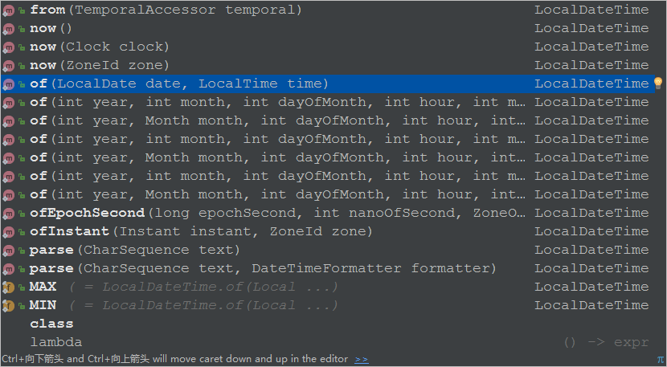
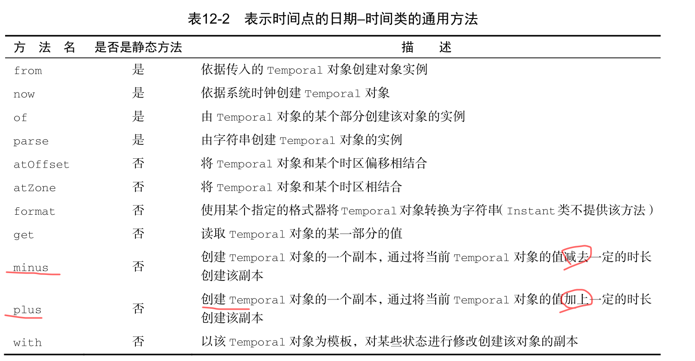
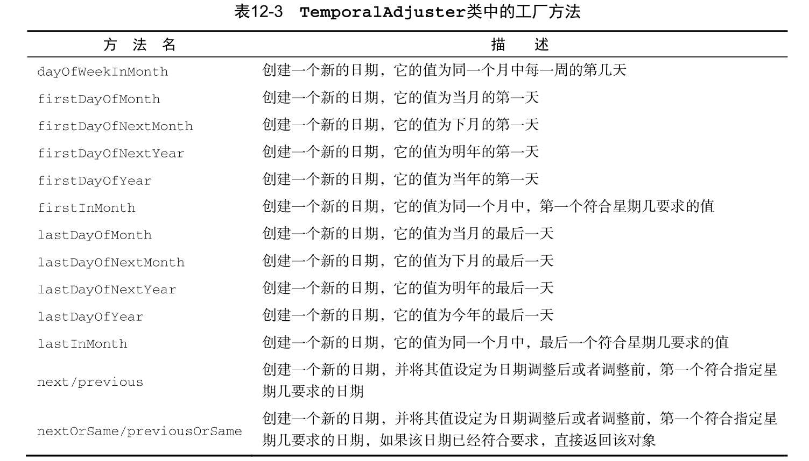

# java8中 新的时间和日期API

Java的API提供了很多有用的组件，能帮助你构建复杂的应用。不过，Java API也不总是完美
的。我们相信大多数有经验的程序员都会赞同Java 8之前的库对日期和时间的支持就非常不理想。
然而，你也不用太担心：Java 8中引入全新的日期和时间API就是要解决这一问题。

为了解决
这些问题，Oracle决定在原生的Java API中提供高质量的日期和时间支持。所以，你会看到Java 8
在 java.time 包中整合了很多Joda-Time的特性。

接下来,我们会一起探索新的日期和时间API所提供的新特性。我们从最基本的用例入手，
    比如创建同时适合人与机器的日期和时间，逐渐转入到日期和时间API更高级的一些应用，比如
    操纵、解析、打印输出日期时间对象，使用不同的时区和年历。
    

## LocalDate,LocalTime.Instant,Duration,以及Period

让我们从探索如何创建简单的日期和时间间隔入手。 java.time 包中提供了很多新的类可以
帮你解决问题，它们是 LocalDate 、 LocalTime 、 Instant 、 Duration 和 Period 。

## 使用LocalDate和LocalTime


* LocalDate

开始使用新的日期和时间API时，你最先碰到的可能是 LocalDate 类。该类的实例是一个不
可变对象，它只提供了简单的日期，并不含当天的时间信息。另外，它也不附带任何与时区相关
的信息

该类不存储或表示时间或时区。 相反，它是日期的描述，用于生日。 它不能代表时间线上的即时信息，而没有附加信息，如偏移或时区。

这个类是不可变的和线程安全的。

你可以通过静态工厂方法of创建一个 LocalDate 实例,LocalDate实例提供了很多的方法来读取常用的 值,比如年份,月份,星期几,是否闰年等等.

下面通过一个例子来简单看一下:

```java
 @Test
    public void test(){

        LocalDate date = LocalDate.of(2017, 11, 23);

        System.out.println("年份:"+date.getYear());

        Month month = date.getMonth();
        System.out.println("月份(单词):"+month);
        int monthValue = date.getMonthValue();
        System.out.println("月份(数字)"+monthValue);

        System.out.println("多少号:"+date.getDayOfMonth());


        System.out.println("返回由此日期表示的月份的长度:"+date.lengthOfMonth());
        System.out.println("返回由此日期表示的年份的长度:"+date.lengthOfYear());

        DayOfWeek dayOfWeek = date.getDayOfWeek();
        System.out.println("星期几(单词):"+dayOfWeek);
        System.out.println("星期几(数字):"+dayOfWeek.getValue());


        System.out.println("一年中的第几天:"+date.getDayOfYear());


        System.out.println("是否是闰年:"+ date.isLeapYear());

        LocalDate a = LocalDate.of(2012, 6, 30);
        System.out.println("检查此日期是否在指定日期之后:"+ date.isAfter(a));
        System.out.println("检查此日期是否在指定日期之前:"+date.isBefore(a));
        System.out.println("检查此日期是否等于指定的日期。"+date.isEqual(a));

        System.out.println("将日期输出:"+date.toString());


    }
```
输出:

```
年份:2017
月份(单词):NOVEMBER
月份(数字)11
多少号:23
返回由此日期表示的月份的长度:30
返回由此日期表示的年份的长度:365
星期几(单词):THURSDAY
星期几(数字):4
一年中的第几天:327
是否是闰年:false
检查此日期是否在指定日期之后:true
检查此日期是否在指定日期之前:false
检查此日期是否等于指定的日期。false
将日期输出:2017-11-23
```

你还可以使用工厂方法 now 从系统时钟中获取当前的日期

```java
LocalDate today = LocalDate.now();
```

* LocalTime

LocalTime是一个不可变的日期时间对象，代表一个时间，通常被看作是小时 - 秒。 时间表示为纳秒精度。 例如，值“13：45.30.123456789”可以存储在LocalTime 。 

它不存储或表示日期或时区。 相反，它是在挂钟上看到的当地时间的描述。 它不能代表时间线上的即时信息，而没有附加信息，如偏移或时区

这个类是不可变的和线程安全的。

类似地，一天中的时间，比如13:45:20，可以使用 LocalTime 类表示。你可以使用 of 重载的
两个工厂方法创建 LocalTime 的实例。第一个重载函数接收小时和分钟，第二个重载函数同时还
接收秒。同 LocalDate 一样， LocalTime 类也提供了一些 getter 方法访问这些变量的值，如下
所示。

```java
 @Test
    public void test3(){
        LocalTime now = LocalTime.now();

        LocalTime time = LocalTime.of(15, 41, 30);
        LocalTime time2 = LocalTime.of(15, 41);

        int hour = time.getHour();
        int minute = time.getMinute();
        int second = time.getSecond();
        System.out.println("小时:"+hour+"分钟:"+minute+"秒:"+second);

        System.out.println(now.toString());

    }
```

LocalDate和LocalTime都可以通过解析代表它们的字符串创建:如

```java
 @Test
    public void test4(){
       String date = "2017-11-23";
       String time = "15:51:30";
        LocalDate localDate = LocalDate.parse(date);
        LocalTime localTime = LocalTime.parse(time);
        System.out.println(localDate);
        System.out.println(localTime);

    }
```

prase还有一个重载方法: `public static LocalDate parse(CharSequence text, DateTimeFormatter formatter)` 

可以传递一个 DateTimeFormatter ,该类的实例订立了如歌格式化一个时间或日期对象.它是替换老版 java.util.DateFormat 的推荐替代品。
后面我们介绍它.同时，也请注意，一旦传递的字符串参数无法被解析为合法的 LocalDate 或 LocalTime 对象，这两个 parse 方法都会抛出一个继
承自 RuntimeException 的 DateTimeParseException 异常


## 合并日期和时间 LocalDateTime

LocalDateTime是一个不可变的日期时间对象，代表日期时间，通常被视为年 - 月 - 日 - 时 - 分 - 秒。 也可以访问其他日期和时间字段，例如日期，星期几和星期。 时间表示为纳秒精度。

该类不存储或表示时区。 相反，它是对日子的描述，如用于生日，结合当地时间在挂钟上看到的。 它不能代表时间线上的即时信息，而没有附加信息，如偏移或时区。 

这个类是不可变的和线程安全的。

LocalDateTime ，是 LocalDate 和 LocalTime 的合体。它同时表示了日期
和时间，但不带有时区信息，你可以直接创建，也可以通过合并日期和时间对象构造，如下所示:



**介绍了LocalDateTime ,LocalDate ,LocalTime ,让我们看看它们之间的互相转换**

```java
     /**
      * LocalDateTime ,LocalDate ,LocalTime 互相转换
      */
     @Test
     public void test5(){
         String date = "2017-11-23";
         String time = "15:51:30";
         LocalDate localDate = LocalDate.parse(date);
         LocalTime localTime = LocalTime.parse(time);
 
         LocalDateTime localDateTime = LocalDateTime.of(2017, 11, 23, 16, 01, 30, 888);
         LocalDateTime localDateTime1 = LocalDateTime.of(localDate, localTime);
 
         //localDateTime-->LocalDate,LocalTime
         LocalDate localDate1 = localDateTime.toLocalDate();
         LocalTime localTime1 = localDateTime.toLocalTime();
 
         // LocalDate,LocalTime --> LocalDateTime
         LocalDateTime localDateTime2 = localDate.atTime(16, 02, 30);
         LocalDateTime localDateTime3 = localTime.atDate(localDate);
 
     }
```


## 机器的日期和时间格式 Instant

* Instant

作为人，我们习惯于以星期几、几号、几点、几分这样的方式理解日期和时间。毫无疑问，
这种方式对于计算机而言并不容易理解。从计算机的角度来看，建模时间最自然的格式是表示一
个持续时间段上某个点的单一大整型数。

这也是新的 java.time.Instant 类对时间建模的方
式，基本上它是以Unix元年时间（传统的设定为UTC时区1970年1月1日午夜时分）开始所经历的
秒数进行计算。

该类在时间线上建立单个瞬时点。 这可能用于在应用程序中记录事件时间戳。

实际上，这一瞬间存在一些限制。 可测量的时间线限制在long中可以持有的long 。 这大于当前估计的宇宙年龄。 该瞬间存储为纳秒分辨率。

这个类是不可变的和线程安全的。

你可以通过向静态工厂方法 ofEpochSecond 传递一个代表秒数的值创建一个该类的实例。静
态工厂方法 ofEpochSecond 还有一个增强的重载版本，它接收第二个以纳秒为单位的参数值，对
传入作为秒数的参数进行调整。重载的版本会调整纳秒参数，确保保存的纳秒分片在0到999 999
999之间。这意味着下面这些对 ofEpochSecond 工厂方法的调用会返回几乎同样的 Instant 对象：

```java
 /**
     * Instant
     */
    @Test
    public void test6(){
        Instant instant = Instant.ofEpochSecond(3);
        //2秒加上100万纳秒(1秒)
        Instant instant1 = Instant.ofEpochSecond(2, 1_000_000_000);

        //4秒减去100万纳秒(1秒)
        Instant instant2 = Instant.ofEpochSecond(4, -1_000_000_000);

        System.out.println(instant);//1970-01-01T00:00:03Z
        System.out.println(instant1);//1970-01-01T00:00:03Z
        System.out.println(instant2);//1970-01-01T00:00:03Z

    }
```

正如你已经在 LocalDate 及其他为便于阅读而设计的日期时间类中所看到的那样，
Instant 类也支持静态工厂方法 now ，它能够帮你获取当前时刻的时间戳。我们想要特别强调一
点， Instant 的设计初衷是为了便于机器使用。它包含的是由秒及纳秒所构成的数字。所以，它
无法处理那些我们非常容易理解的时间单位。比如下面这段语句：

```java
int day = Instant.now().get(ChronoField.DAY_OF_MONTH);
```

它会抛出下面这样的异常：

        java.time.temporal.UnsupportedTemporalTypeException: Unsupported field:
        DayOfMonth
但是你可以通过 Duration 和 Period 类使用 Instant ，接下来我们会对这部分内容进行介绍。

## 定义 Duration 或 Period

目前为止，你看到的所有类都实现了 Temporal 接口， Temporal 接口定义了如何读取和操纵
为时间建模的对象的值。之前的介绍中，我们已经了解了创建 Temporal 实例的几种方法。很自
然地你会想到，我们需要创建两个 Temporal 对象之间的 duration 。 Duration 类的静态工厂方
法 between 就是为这个目的而设计的。你可以创建两个 LocalTimes 对象、两个 LocalDateTimes对象，或者两个 Instant 对象之间的 duration ，如下所示：

```java
Duration d1 = Duration.between(time1, time2);
Duration d1 = Duration.between(dateTime1, dateTime2);
Duration d2 = Duration.between(instant1, instant2);
```

由于 LocalDateTime 和 Instant 是为不同的目的而设计的，一个是为了便于人阅读使用，
另一个是为了便于机器处理，所以你不能将二者混用。如果你试图在这两类对象之间创建
duration ，会触发一个 DateTimeException 异常。此外，由于 Duration 类主要用于以秒和纳
秒衡量时间的长短，你不能仅向 between 方法传递一个 LocalDate 对象做参数。
如果你需要以年、月或者日的方式对多个时间单位建模，可以使用 Period 类。使用该类的
工厂方法 between ，你可以使用得到两个 LocalDate 之间的时长，如下所示：

```java
Period tenDays = Period.between(LocalDate.of(2014, 3, 8),
LocalDate.of(2014, 3, 18));
```


截至目前，我们介绍的这些日期时间对象都是不可修改的，这是为了更好地支持函数式编
程，确保线程安全，保持领域模式一致性而做出的重大设计决定。当然，新的日期和时间API也
提供了一些便利的方法来创建这些对象的可变版本。比如，你可能希望在已有的 LocalDate 实例
上增加3天。我们在下一节中会针对这一主题进行介绍。除此之外，我们还会介绍如何依据指定
的模式，比如 dd/MM/yyyy ，创建日期时间格式器，以及如何使用这种格式器解析和输出日期。


## 操纵、解析和格式化日期

如果你已经有一个 LocalDate 对象，想要创建它的一个修改版，最直接也最简单的方法是使
用 withAttribute 方法。 withAttribute 方法会创建对象的一个副本，并按照需要修改它的属
性。注意，下面的这段代码中所有的方法都返回一个修改了属性的对象。它们都不会修改原来的
对象！


```java
@Test
    public void test7(){
        LocalDate date = LocalDate.of(2014, 12, 18);
        LocalDate date2 = date.withYear(2017);
        System.out.println(date2);//2017-12-18
        LocalDate date3 = date2.withDayOfMonth(25);
        System.out.println(date3);//2017-12-25
        LocalDate date4 = date3.with(ChronoField.MONTH_OF_YEAR, 9);
        System.out.println(date4);//2017-09-25


    }
```

`LocalDate date4 = date3.with(ChronoField.MONTH_OF_YEAR, 9);`

采用更通用的 with 方法能达到同样的目的，它接受的第一个参数是一个 TemporalField 对
象,比如最后这一行中使用的 with 方法.

所有的日期和时间API类都实现这个方法,比如 LocalDate 、 LocalTime 、 LocalDateTime 以及 Instant .

更确切
地说，使用 get 和 with 方法，我们可以将 Temporal 对象值的读取和修改区分开。如果 Temporal
对象不支持请求访问的字段，它会抛出一个 UnsupportedTemporalTypeException 异常，比
如试图访问 Instant 对象的 ChronoField.MONTH_OF_YEAR 字段，或者 LocalDate 对象的
ChronoField.NANO_OF_SECOND 字段时都会抛出这样的异常。

它甚至能以声明的方式操纵 LocalDate 对象。比如，你可以像下面这段代码那样加上或者减
去一段时间

```java
 @Test
    public void test8(){
        LocalDate date1 = LocalDate.of(2014, 3, 18);
        LocalDate date2 = date1.plusWeeks(1);
        System.out.println(date2);//2014-03-25
        LocalDate date3 = date2.plusYears(3);
        System.out.println(date3);//2017-03-25
        
        LocalDate date4 = date3.plus(6, ChronoUnit.MONTHS);
        System.out.println(date4);//2017-09-25


    }
```
`LocalDate date4 = date3.plus(6, ChronoUnit.MONTHS);`
与我们刚才介绍的 get 和 with 方法类似，代码中最后一行使用的 plus 方法也是通用
方法，它和 minus 方法都声明于 Temporal 接口中。通过这些方法，对 TemporalUnit 对象加上
或者减去一个数字，我们能非常方便地将 Temporal 对象前溯或者回滚至某个时间段，通过
**ChronoUnit** 枚举我们可以非常方便地实现 TemporalUnit 接口.


大概你已经猜到，像 LocalDate 、 LocalTime 、 LocalDateTime 以及 Instant 这样表示时
间点的日期时间类提供了大量通用的方法，下表对这些通用的方法进行了总结



## 使用 TemporalAdjuster 调整时间对象的策略

截至目前，你所看到的所有日期操作都是相对比较直接的。有的时候，你需要进行一些更加
复杂的操作，比如，将日期调整到下个周日、下个工作日，或者是本月的最后一天。

这时，你可
以使用重载版本的 with 方法，向其传递一个提供了更多定制化选择的 TemporalAdjuster 对象，
更加灵活地处理日期。对于最常见的用例，日期和时间API已经提供了大量预定义的
TemporalAdjuster 。你可以通过 TemporalAdjuster 类的静态工厂方法访问它们，如下所示:

```java
 @Test
    public void test9(){
        LocalDate date = LocalDate.of(2017, 11, 23);
        //调整日期到本周日
        LocalDate localDate = date.with(TemporalAdjusters.nextOrSame(DayOfWeek.SUNDAY));
        System.out.println(localDate);//2017-11-26
        //调整日期到本月最后一天
        LocalDate localDate1 = localDate.with(TemporalAdjusters.lastDayOfMonth());
        System.out.println(localDate1);//2017-11-30


    }
```
表12-3提供了 TemporalAdjuster 中包含的工厂方法列表。



正如我们看到的，使用 TemporalAdjuster 我们可以进行更加复杂的日期操作，而且这些方
法的名称也非常直观，方法名基本就是问题陈述。此外，即使你没有找到符合你要求的预定义的
TemporalAdjuster ，创建你自己的 TemporalAdjuster 也并非难事。实际上， Temporal-
Adjuster 接口只声明了单一的一个方法（这使得它成为了一个函数式接口），定义如下。

```java
@FunctionalInterface
public interface TemporalAdjuster {
Temporal adjustInto(Temporal temporal);
}
```

这是一个功能界面，因此可以用作lambda表达式或方法引用的赋值对象。 

举例:

> 请设计一个 NextWorkingDay 类，该类实现了 TemporalAdjuster 接口，能够计算明天
的日期，同时过滤掉周六和周日这些节假日。

如果你想要使用Lambda表达式定义 TemporalAdjuster 对象，推荐使用 Temporal-
Adjusters 类的静态工厂方法 ofDateAdjuster ，它接受一个 UnaryOperator<LocalDate>
类型的参数，代码如下：

```java
@Test
    public void test10() {
        LocalDate date = LocalDate.of(2017, 11, 23);
        TemporalAdjuster nextWorkingDay = TemporalAdjusters.ofDateAdjuster(
                temporal -> {
                    //读取当前天数
                    DayOfWeek dow = DayOfWeek.of(temporal.get(ChronoField.DAY_OF_WEEK));
                    //正常情况增加1天
                    int dayToAdd = 1;
                    //如果当天是周五,增加三天
                    if (dow == DayOfWeek.FRIDAY) {
                        dayToAdd = 3;
                    }
                    //如果当天是周六增加两天
                    if (dow == DayOfWeek.SATURDAY) {
                        dayToAdd = 2;
                    }
                    //增加恰当的天数后,返回修改的日期
                    return temporal.plus(dayToAdd, ChronoUnit.DAYS);
                });
        date = date.with(nextWorkingDay);
    }
```

## 打印输出及解析日期 时间对象

处理日期和时间对象时，格式化以及解析日期时间对象是另一个非常重要的功能。新的
java.time.format 包就是特别为这个目的而设计的。这个包中，最重要的类是 DateTime-
Formatter 。

创建格式器最简单的方法是通过它的静态工厂方法以及常量。像 BASIC_ISO_DATE
和 ISO_LOCAL_DATE 这 样 的 常 量 是 DateTimeFormatter 类 的 预 定 义 实 例 。 所 有 的
DateTimeFormatter 实例都能用于以一定的格式创建代表特定日期或时间的字符串。比如，下
面的这个例子中，我们使用了两个不同的格式器生成了字符串：

```java
@Test
    public void test11() {
        LocalDate date = LocalDate.of(2017, 11, 23);
        System.out.println(date);

        String format = date.format(DateTimeFormatter.BASIC_ISO_DATE);
        System.out.println(format);//20171123

        String format1 = date.format(DateTimeFormatter.ISO_LOCAL_DATE);
        System.out.println(format1);//2017-11-23

        


    }
```

你也可以通过解析日期或时间字符串重新重新创建改日期对象.

```java
@Test
    public void test12() {
        LocalDate localDate = LocalDate.parse("20171123", DateTimeFormatter.BASIC_ISO_DATE);
        System.out.println(localDate);//2017-11-23

        LocalDate localDate1 = LocalDate.parse("2017-11-23", DateTimeFormatter.ISO_LOCAL_DATE);
        System.out.println(localDate1);//2017-11-23


    }
```


和老的 java.util.DateFormat 相比较，所有的 DateTimeFormatter 实例都是线程安全
的。所以，你能够以单例模式创建格式器实例，就像 DateTimeFormatter 所定义的那些常量，
并能在多个线程间共享这些实例。 DateTimeFormatter 类还支持一个静态工厂方法，它可以按
照某个特定的模式创建格式器

```java
@Test
    public void test13() {
        DateTimeFormatter pattern = DateTimeFormatter.ofPattern("dd/MM/yyyy");// dd天 ,MM月 ,yyyy年
        LocalDate date = LocalDate.of(2017, 11, 23);
        String format = date.format(pattern);
        System.out.println(format);//23/11/2017

    }
```
这段代码中， LocalDate 的 formate 方法使用指定的模式生成了一个代表该日期的字符串。
紧接着，静态的 parse 方法使用同样的格式器解析了刚才生成的字符串，并重建了该日期对象。


# 小结

*   Java 8之前老版的 java.util.Date 类以及其他用于建模日期时间的类有很多不一致及
  设计上的缺陷，包括易变性以及糟糕的偏移值、默认值和命名

*  新版的日期和时间API中，日期时间对象是不可变的。

* 新的API提供了两种不同的时间表示方式，有效地区分了运行时人和机器的不同需求

* 你可以用绝对或者相对的方式操纵日期和时间，操作的结果总是返回一个新的实例，老
  的日期时间对象不会发生变化。

*  TemporalAdjuster 让你能够用更精细的方式操纵日期，不再局限于一次只能改变它的
  一个值，并且你还可按照需求定义自己的日期转换器
  
* 你现在可以按照特定的格式需求，定义自己的格式器，打印输出或者解析日期时间对象。
  这些格式器可以通过模板创建，也可以自己编程创建，并且它们都是线程安全的。
  
  


